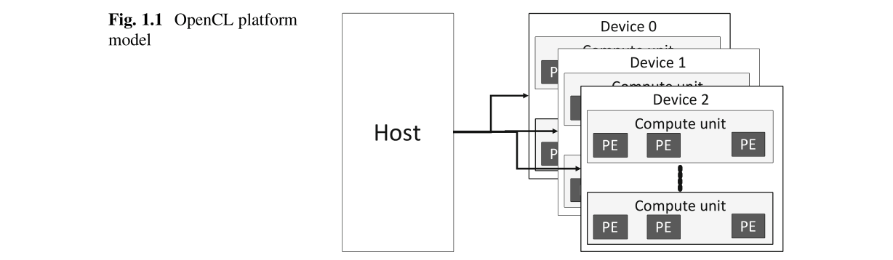
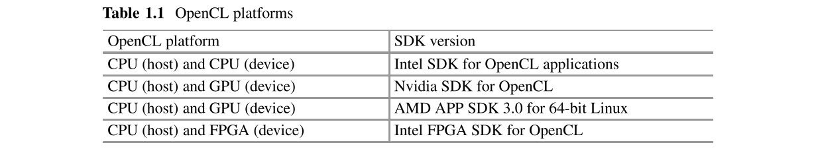
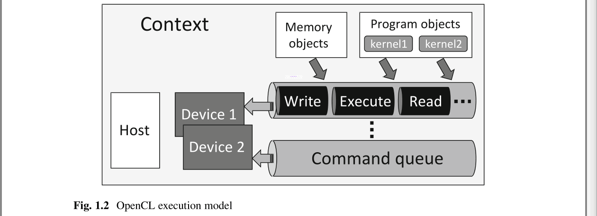
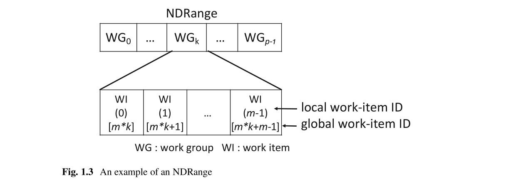
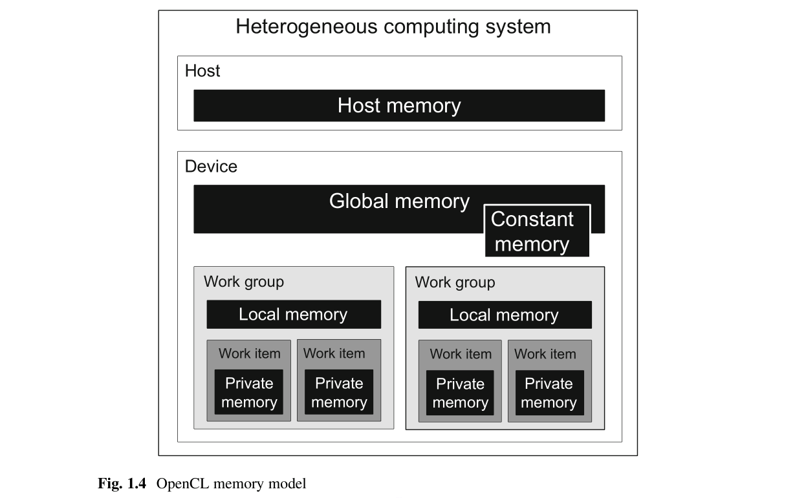
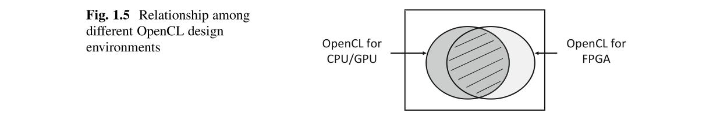

# Ch1 Background

## 1.1 Trends of Heterogeneous Computing

异构计算使用几种类型的处理器来最佳地执行计算任务。在异构计算系统中，中央处理器（CPU），数字信号处理器（DSP），媒体处理器，图形处理单元（GPU）和向量处理器等不同类型的处理器可以和谐地执行程序，以实现高性能并降低功耗。这种架构已经存在了40多年。在超级计算机领域，结合了CPU和向量算术处理器的向量超级计算机在1970年代后半期[1]，[2]首次商业化。在消费电子产品中，这种异构计算被用于各种设备，例如视频游戏机和智能电话。例如，2005年开发的用于视频游戏的LSI，LSI嵌入了CPU内核和8个单指令多数据（SIMD）处理器内核，以执行需要实时计算大量三维图形数据的游戏软件[3]。2016年开发的智能手机片上系统（SoC）包含四个CPU内核，一个GPU内核和一个DSP内核，以灵活地支持各种移动应用[4]。

异构计算流也正在传播到云计算。微软一直在使用现场可编程门阵列（FPGA）来加快针对云服务的搜索引擎和机器学习的速度，从而降低功耗[5]。Google一直在使用GPU来加速机器学习[6]，并且还开发了专门用于机器学习加速的张量处理单元（TPU）[7]。另外，亚马逊的云服务提供了异构计算平台，其中GPU和FPGA用作加速器[8]。

最近，GPU和FPGA作为异构计算的加速器吸引了很多关注。由于半导体微型化的优点，对于两者而言，可集成在芯片上的计算单元的数量都在增加。结果，计算性能大大提高。截至2017年，GPU和FPGA的单精度浮点性能已达到每秒10 tera浮点运算（TFLOPS），远远超过了CPU的计算性能。由于其强大的计算能力，GPU和FPGA都已在许多领域用作加速器，包括图像/信号处理，密码处理，生物信息学，CAD/CAE/CAM应用，计算流体动力学，金融工程和机器学习。

GPU是一种处理器类型的加速器，可将许多算术内核安装到芯片上。尽管GPU软件设计人员需要开发一种并行程序，以SIMD方式在嵌入式算术内核上并行运行，但已经为此类并行编程开发了CUDA [9]和开放计算语言（OpenCL）[10]之类的软件开发环境，并使软件工程师更轻松地为GPU开发程序。另一方面，由于FPGA可以自由配置其内部逻辑，因此FPGA加速器可以采用任何类型的架构，例如数据流，脉动阵列和SIMD/多指令多数据（MIMD）处理器。通过为算法或处理选择最佳架构，FPGA加速器可以实现比GPU更高的整体性能和每瓦性能[11-13]。但是，**在实现FPGA加速器时，必须首先在FPGA上使用硬件构建算法的目标体系结构**。有时，这种硬件设计过程是使软件工程师远离FPGA加速器的一个因素。

## 1.2 OpenCL Models for Heterogeneous Computing

OpenCL规范分为四个部分定义，称为“模型”。在本节中简要描述这些模型。

### 1.2.1 Platform Model

OpenCL平台由一台主机和一个或多个设备组成，如图1.1所示。它为设备提供了抽象的硬件模型。**一个设备由多个计算单元（compute units）组成，一个计算单元由多个处理单元（PE）组成**。

**一个系统中可能有多个OpenCL Platform**。通常，多个平台不会相互交互。平台对应于供应商提供的SDK（软件开发套件）。表1.1显示了一些可用的平台及其相应的SDK。我们只能使用SDK支持的设备。**设备也可能受到其设备驱动程序的限制**。通常，对于不同的设备，设备驱动程序是不同的。在Sect.2.2.3中介绍了如何找到OpenCL平台和设备。

### 1.2.2 Execution Model

**执行模型**定义**主机如何与设备通信以及主机如何以及何时在设备上执行程序**。图1.2显示了执行模型。
使用一个或多个设备创建一个OpenCL上下文。它为主机-设备交互，内存管理，设备控制等提供了环境。

**命令队列(command queue)是主机用来请求设备操作的通信机制。每个设备至少必须创建一个命令队列**。**主机发出命令**，例如数据写入，数据读取，执行内核等。这些命令存储在命令队列中并适当发出。主机还管理命令**执行顺序**及其相关性。

### 1.2.3 Kernel Programming Model

内核(Kernels)是在OpenCL设备上执行的功能。内核执行的单位称为工作项(work-item)。工作项目被组织到工作组(work-group)中。整个工作项集合称为NDRange，其中工作组和工作项可以划分为N个维度，其中N的最大值为3。

为了解释工作组和工作项之间的关系，我们考虑图1.3中所示的示例。它显示一维`NDRange`。它包含$p$个工作组，每个工作组包含$m$个工作项。`NDRange`和工作组的大小由主机程序指定。在内核程序中，工作项由其全局工作项ID(global work-item ID)和本地工作项ID(local work-item ID)标识。本地工作项ID用于标识工作组中的工作项。因此，属于不同工作组的两个工作项可以具有相同的本地工作项ID。全局工作项ID用于标识NDRange中的任何工作项。因此，每个工作项都有一个唯一的全局工作项ID。

### 1.2.4 Memory Model

图1.4显示了OpenCL内存模型。主机和设备中的存储器分别称为主机和设备内存( host and device memories)。主机内存仅可由主机访问。为了使设备使用主机内存中的数据，应首先将这些数据传输到设备的全局内存( global memory)中。主机和设备均可访问全局内存。constant内存是设备的只读内存。本地内存(local memory)属于特定的工作组。特定工作组的本地内存中的数据由其工作项共享，而其他工作组无法访问这些数据。私有内存(private memory)属于工作项。每个工作项目都可以有自己的私有内存，其他工作项目则无法访问。存储器模型将在第5章中详细解释。

## 1.3 OpenCL for FPGA-Based Computing Systems

如章节1.1中所述。FPGA现在用于开发从低功耗嵌入式应用到高性能计算的各个领域的定制加速器。由于半导体小型化技术的优势，FPGA的尺寸一直在增加，其中包含各种硬件资源，例如逻辑块，DSP块，存储块和CPU内核。此外，为了开发大规模系统，FPGA通过诸如Peripheral Component Interconnect Express（PCIe）之类的高速接口作为加速器连接到CPU，并且/或者彼此互联形成集群，以进行高性能计算和大数据处理。

使用硬件描述语言（HDL）的传统设计方法已变得效率低下，因为设计人员更难以为此类大型而复杂的基于FPGA的系统开发电路细节和控制状态。使用C语言的设计方法比基于HDL的设计方法更有效，因为它们允许设计人员定义高级行为描述。即使设计人员使用基于C的设计工具，设计整个系统也不是一件容易的事。基于C的设计工具只能在FPGA内部生成数据路径。它们不支持FPGA与外部存储设备之间的接口，也不支持FPGA与主机CPU之间的接口。设计人员仍然需要使用HDL来设计接口电路。

为了解决这些问题，最近在FPGA设计中引入了基于C的OpenCL设计环境。OpenCL允许设计人员描述整个计算：主机上的计算，主机与加速器之间的数据传输以及加速器上的计算。因此，通过分析OpenCL代码，用于FPGA的OpenCL设计环境可以生成带有接口的FPGA电路。

## 1.4 Differences Among OpenCL-Based Design Environments

图1.5显示了不同OpenCL设计环境之间的关系。适用于FPGA的OpenCL基于OpenCL 1.0，但包含许多扩展功能，可以充分利用FPGA的潜力。因此，本书中的技术和代码通常无法在其他OpenCL环境中使用[14]。

