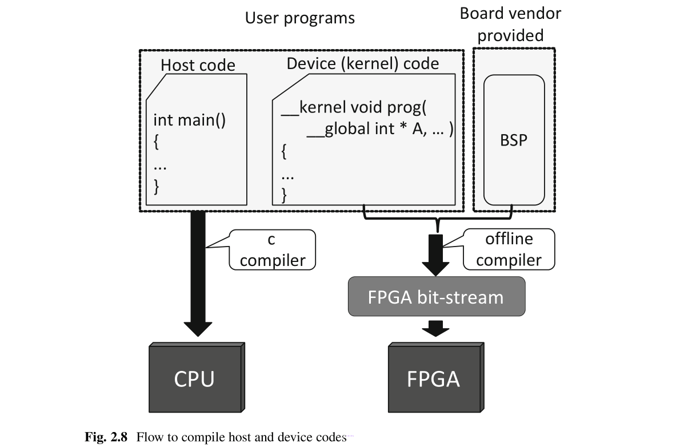

# Ch2 Introduction to OpenCL for FPGA

## 2.1 FPGA

FPGA是可编程硬件[1、2]，可以在制造后重新配置。它包含可编程逻辑门和可编程互连，如图2.1所示。FPGA还包含可配置的存储器模块和DSP（专用乘法器）。我们可以连接这些逻辑门，DSP和存储器来实现任意电路。因此，可以在FPGA上实现许多处理器或加速器以执行不同的计算。FPGA已用于许多领域，例如信号处理[3，4]，高性能计算[5，6]，机器学习[7]等。


与ASIC（专用集成电路）相比，FPGA是一种经济高效的解决方案。诸如Verilog HDL [8]和VHDL [9]之类的硬件描述语言已用于对FPGA进行编程。为了设计高性能的加速器，程序员必须具有丰富的硬件设计知识和经验。此外，基于HDL的设计需要周期级别的仿真和调试。结果，加速器的设计时间非常长。为了解决这些问题，最近推出了用于FPGA设计的OpenCL [10，11]。

## 2.2 OpenCL for FPGA

### 2.2.1 Heterogeneous Computing System with FPGAs

图2.2显示了两种基于CPU和FPGA的异构计算系统。图2.2a显示了SoC（片上系统）类型的计算系统，其中CPU和FPGA集成在同一封装或同一芯片上[12]。CPU和FPGA之间的数据传输是通过内部（片上）总线完成的。这种类型的系统通常用于低功耗嵌入式处理[13，14]。图2.2b显示了另一种具有CPU和FPGA的计算系统。在该系统中，FPGA通过诸如PCI-express（PCIe）之类的外部总线连接到CPU。CPU和FPGA之间的数据传输是通过PCIe总线完成的。这种类型的系统通常用于高性能计算[15，16]。**本书的范围主要涵盖具有通过PCIe连接的FPGA的异构计算系统**。


有许多具有不同输入/输出（I/O）资源的FPGA板，例如外部存储器，PCI Express，USB等。此外，有许多FPGA是为不同目的而设计的，例如低功耗应用和高性能计算。这些FPGA的逻辑和存储器资源存在很大差异。结果，通常很难在不知道I/O，逻辑和存储器资源的情况下在不同的FPGA板上使用相同的代码。图2.3显示了如何解决此问题。OpenCL for FPGA使用包含逻辑和内存信息的板级支持软件包（BSP），以及I/O控制器，例如DDR3控制器，PCI控制器等，如图2.3所示。在编译过程中，内核（kernels）将与BSP合并。结果，内核可以通过BSP访问I/O。由于BSP负责I/O和FPGA资源，因此可以在任何支持OpenCL的FPGA板上使用相同的内核代码。


为了使用OpenCL内核，您必须使用目标FPGA板的BSP信息对其进行编译。当脱机编译器版本更改时，某些BSP可能不适用于较新的版本。在这种情况下，主板供应商可能会提供新的BSP版本。请注意，您可以根据“用于OpenCL的Intel FPGA SDK自定义平台工具包用户指南” [17]中给出的说明编写自己的BSP。但是，设计您自己的BSP是一项艰巨的任务，它需要有关FPGA的广泛知识。

### 2.2.2 Setting Up the OpenCL Design Environment

本节说明如何为具有CPU和FPGA的异构计算系统设置OpenCL设计环境（图2.2b）。要将OpenCL用于FPGA，您需要编译器软件，BSP和许可证文件。要编译内核，您需要一个内存超过24GB的工作站。我们建议使用64GB或更多的内存，以使编译更流畅。软件安装过程如图2.4所示。以下各节将详细说明每个步骤。


#### 2.2.2.1 Software Installation

设置过程的第一步是安装Quartus编译器软件，用于OpenCL的SDK和BSP。当前的编译器是“ Quartus prime Edition”，并且支持从15.1到17.0的版本的OpenCL SDK [18]。不同的版本支持不同的FPGA类型。表2.1总结了不同版本的兼容性。在本书中，我们使用所有软件的Linux版本，并且操作系统为CentOS 7。


BSP供应商或主板供应商提供了BSP安装说明。通常，将BSP文件复制到以下路径中的board文件夹中。

```bash
<Quartus_installation_directory>/hld/board
```

此外，还必须安装GNU开发工具，例如gcc（包括g ++）和make。这些是在Linux环境中构建FPGA板驱动程序和应用程序所必需的。

#### 2.2.2.2 License File Installation

您需要许可证才能使用Quartus Prime标准版或专业版，以及用于OpenCL [19]的Intel FPGA SDK。您可能还需要许可证才能使用BSP中包含的某些IP内核。许可证有两种类型，固定许可证和浮动许可证。固定许可证安装在用于编译的工作站上。浮动许可证安装在服务器上，并由远程工作站使用。您必须按照“英特尔FPGA软件安装和许可”手册[20]中的说明配置FlexLM许可服务器。同时编译的数量取决于许可证中可用的插槽数量。

许可证文件由环境变量`LM_LICENSE_FILE`引用。该变量的值是许可证文件的路径。您可以使用冒号分隔不同的路径。您还可以将浮动许可证文件和固定许可证文件的路径一起引用，如下所示。

```bash
LM_LICENSE_FILE /license/file1. dat: /license/file2. dat:1800@server
```

#### 2.2.2.3 Setting Environment Variables

第三步是设置环境变量。环境变量`QUARTUS_ROOTDIR`指定Quartus安装路径。在CentOS中，您可以将环境变量添加到`.bashrc`文件中。如果使用其他Linux发行版，请参考手册以查找如何设置环境变量。CentOS中的环境变量示例如下所示。

```bash
export QUATUS_64BIT=1
export LM_LICENSE_FILE=1800@192. 168. 1. 80:/usr/. . . /license/lic1512.dat
export QUARTUS_ROOTDIR=/usr/. . . /16. 1/quartus
export QSYS_ROOTDIR="$QUARTUS_ROOTDIR"/sopc_builder/bin
export ALTERAOCLSDKROOT=/usr/. . . /16. 1/hld
export AOCL_BOARD_PACKAGE_ROOT="$ALTERAOCLSDKROOT"/board/terasic/de5net
export LD_LIBRARY_PATH=$LD_LIBRARY_PATH:"$QUARTUS_ROOTDIR"/linux64:"$AOCL_BOARD_PACKAGE_ROOT"/linux64/lib:"$ALTERAOCLSDKROOT"/host/linux64/lib
export PATH=$PATH: "$QUARTUS_ROOTDIR"/bin:"$ALTERAOCLSDKROOT"/linux64/bin:"$ALTERAOCLSDKROOT"/bin: /usr/. . . /16. 1/qsys/bin
```

您可以通过以下命令检测FPGA板的环境变量是否设置正确。

```bash
aoc --list-boards
Board list:
de5net_a7
```

如果正确检测到板，您将获得板名称，例如`de5a_net_i2`。在对配置ROM进行编程时以及在编译内核时，都需要使用该板名。

#### 2.2.2.4 FPGA Board Driver Installation

如果检测到FPGA板，则可以继续安装驱动程序。您需要管理员权限才能安装驱动程序。以下命令用于安装驱动程序。

```bash
aocl install
```

如果驱动程序安装成功，您会看到类似于图2.5所示的消息。


#### 2.2.2.5 Programming the Configuration ROM

首次使用新的FPGA板或更改BSP时，应对FPGA板的配置ROM进行编程。对配置ROM进行编程后，重新启动FPGA板以启用新配置。通常，电路板供应商提供配置数据以对配置ROM进行编程。配置数据文件带有`.aocx`扩展名。使用以下命令对配置ROM进行编程。

```bash
aocl flash <board_name> <configuration_data>. aocx
```

<board_name>是使用`aocl --list-boards`命令获得的名称。请注意，您必须在CentOS中配置USB blaster才能对配置ROM进行编程。

#### 2.2.2.6 Running the Diagnostic Test

完成上述所有步骤后，即可使用FPGA板。您可以运行“主板诊断测试”来验证OpenCL设计环境的设置。在该测试中，主机CPU将数据写入外部存储器的所有地址。然后主机读回并验证数据。此后，主机将计算写入和读取速度以及内存访问吞吐量。

为了执行板卡诊断测试，您必须找到设备名称。如果工作站中有多个FPGA板，则用唯一的设备名称标识。以下命令提供了FPGA板的**设备名称**。

```bash
aocl diagnose
```


图2.6显示了`aocl`诊断命令的输出。如您所见，设备名称为`acl0`。您可以选择一个设备（acl0）并使用以下命令运行电路板**诊断测试**。

```bash
aocl diagnose <device_name>
```

诊断测试结果的示例如图2.7所示。如果您收到消息`DIAGNOSTIC PASSED`，则说明OpenCL设计环境设置成功。


### 2.2.3 Writing the First OpenCL Program for FPGA

在OpenCL for FPGA中，您必须**编写两种类型的代码**，即主机代码和设备（或内核）代码，如图2.8所示。主机代码用于对CPU进行编程。主机代码用C语言编写，并由gcc等C编译器进行编译。kernel代码负责FPGA上的计算。kernel代码是用OpenCL编写的，它也类似于C语言。为了提供FPGA比特流，kernel代码由OpenCL SDK中包含的脱机编译器编译并与BSP合并。



#### 2.2.3.1 Kernel Code

让我们考虑第一个如图2.9所示工作的OpenCL程序。


它将整数40加到数组k_din中的所有元素，并将输出结果写入数组k_dout。清单2.1显示了用于此计算的OpenCL内核代码。此代码被编写为单个工作项内核。还有另一种内核，称为NDRange内核。4.1节详细解释了内核类型。


#### 2.2.3.2 Host Code

主机代码执行以下任务。
- 获取OpenCL平台和设备。
- 创建上下文和命令队列。
- 对FPGA进行编程。
- 分配内存。
- 将输入数据从主机传输到设备。
- 执行内核。
- 将输出结果从设备传输到主机。
- 释放分配的内存。

这些任务应基本上**按此顺序执行**。我们将在下面详细说明任务。

**S1. 获取OpenCL平台和设备**

此任务是通过以下代码获取OpenCL平台的平台处理程序。

```c
cl_platform_id fpga_paltform = NULL;
clGetPlatformIDs(1, &fpga_paltform, NULL) ;
```

该设备通过如下获得。

```c
cl_device_id fpga_device = NULL;
clGetDeviceIDs(fpga_paltform, CL_DEVICE_TYPE_ALL, 1, &fpga_device, NULL) ;
```

**S2. 创建上下文和命令队列**

上下文创建如下。

```c
cl_context context = clCreateContext(NULL, 1, &fpga_device, NULL, NULL, NULL) ;
```

然后创建上下文的命令队列。

```c
cl_command_queue queue = clCreateCommandQueue(context, fpga_device, 0, NULL) ;
```

**S3. 对FPGA进行编程**

C语言中的函数fread用于读取FPGA配置数据文件，如下所示。

```c
size_t length = 0x10000000;
unsigned char * binary = (unsigned char * ) malloc(length) ;
FILE * fp = fopen("FirstProgram. aocx", "rb") ;
fread(binary, length, 1, fp) ;
fclose(fp) ;
```

二进制文件`FirstProgram.aocx`包含FPGA配置数据，是通过使用离线编译器编译内核代码而获得的。然后，按如下创建程序。

```c
cl_program program = clCreateProgramWithBinary(context, 1, &fpga_device, &length, 
(const unsigned char ** ) &binary, NULL, NULL) ;
```

内核按如下创建。

```c
cl_kernel kernel = clCreateKernel(program, "FirstProgram", NULL) ;
```

第二个参数是内核名称。作为内核名称，我们设置清单2.1中给出的“ FirstProgram”。

**S4. 分配内存**

我们**分配主机内存**并准备要在FPGA中处理的输入数据。下面的代码分配“ sizeof（int）* N”个字节的两个数组`host_din`和`host_dout`，并将其初始化。

```c
int * host_din, * host_dout;
posix_memalign((void ** ) (&host_din) , 64, sizeof(int) * N) ;
posix_memalign((void ** ) (&host_dout) , 64, sizeof(int) * N) ;
for(int i=0; i<N; i++)
{
  host_din[i] = i;
  host_dout[i] = 0;
}
```

为了访问设备内存，必须创建**内存对象**。内存对象指定**设备中的内存位置**。以下代码创建两个内存对象`dev_din`和`dev_dout`分别在设备中存储输入和输出数据。【注：代码笔误还是说明笔误？】

```c
cl_mem dev_din = clCreateBuffer(context, CL_MEM_READ_ONLY, sizeof(int) * N, NULL, NULL) ;
cl_mem dev_dout = clCreateBuffer(context, CL_MEM_WRITE_ONLY, sizeof(int) * N, NULL, NULL) ;
```

内存对象`dev_din`和`dev_dout`分别对应于主机内存数组`host_din`和`host_dout`。因此，每个内存对象的大小必须等于其相应内存数组的大小。请注意，`dev_din`被定义为只读，而`dev_dout`被定义为只写。如果将内存对象用于读取和写入，则应将`CL_MEM_READ_WRITE`标志设置为`clCreateBuffer`的第二个参数。

**S5. 将输入数据从主机传输到设备**

在执行内核之前，内核的输入数据按如下从主机传输到设备。

```c
clEnqueueWriteBuffer(queue, dev_din, CL_TRUE, 0, sizeof(int) * N, host_din, 0, NULL, NULL) ;
```

由于我们使用了`CL_TRUE`标志，因此`clEnqueueWriteBuffer`函数将在数据传输完成后返回。

**S6. 执行内核**

为了执行内核，应指定内核函数的参数。清单2.1中显示了内核中的两个参数。第一个是输入数据`k_din`，第二个是输出数据`k_dout`。以下代码将`dev_din`指定为第一个参数，将`dev_dout`指定为第二个参数。

```c
clSetKernelArg(kernel, 0, sizeof(cl_mem) , &dev_din) ;
clSetKernelArg(kernel, 1, sizeof(cl_mem) , &dev_dout) ;
```

`clSetKernelArg`的第二个参数指定参数编号；值0和1分别代表内核函数的第一个和第二个参数。

以下代码执行内核。

```c
cl_event kernel_event;
clEnqueueTask(queue, kernel, 0, NULL, &kernel_event) ;
clWaitForEvents(1, &kernel_event) ;
clReleaseEvent(kernel_event) ;
```

`cl_event`类型的变量`kernel_event`用于检测内核执行的完成。函数`clWaitForEvents`等待设置`kernel_event`。

**S7. 将输出结果从设备传输到主机**

内核将输出结果存储到设备内存`k_dout`中，主机可以使用内存对象`dev_dout`访问该位置。以下代码将设备中的输出结果传输到主机内存`host_dout`。

```c
clEnqueueReadBuffer(queue, dev_dout, CL_TRUE, 0, sizeof(int) * N, host_dout, 0, NULL, NULL) ;
```

由于我们使用了`CL_TRUE`标志，因此`clEnqueueReadBuffer`函数将在数据传输完成后返回。

我们使用以下代码显示部分计算结果。

```c
for(int i=N-10; i<N; i++)
  printf("din[%d] = %d; dout[%d] = %d\n", i, host_din[i] , i, host_dout[i] ) ;
```

**S8. 释放分配的内存**

最后，我们确保命令队列中没有剩余命令，然后按以下步骤释放设备和主机中分配的内存。

```c
clFlush(queue) ;
clFinish(queue) ;
//device side
clReleaseMemObj ect(dev_din) ;
clReleaseMemObj ect(dev_dout) ;
clReleaseKernel(kernel) ;
clReleaseProgram(program) ;
clReleaseCommandQueue(queue) ;
clReleaseContext(context) ;
//host side
free(host_din) ;
free(host_dout) ;
```

清单2.2显示了将所有内容放在一起后的完整主机代码。


### 2.2.4 Compilation and Execution

我们使用以下命令为Terasic “DE5a-Net Arria 10 FPGA开发套件” [21]编译清单2.1中所示的代码。

```bash
aoc FirstProgram. cl -o FirstProgram. aocx --board de5net_a7 --report
```

选项`--report`允许报告编译消息，如图2.10所示。如果编译成功完成，则生成二进制文件`FirstProgram.aocx`。该文件用于主机配置FPGA。


执行结果如图2.11所示。我们可以看到计算结果是准确的。


## 2.3 HDL vs. OpenCL

本节描述了OpenCL for FPGA相对HDL的优缺点。

### 2.3.1 Advantages

#### 2.3.1.1 Designing with C-Language

在基于OpenCL的设计中，我们可以使用类似C的OpenCL代码来设计FPGA加速器。因此，我们可以大大减少设计时间。另一方面，基于HDL的设计需要花费更长的时间进行编码，仿真和调试。

#### 2.3.1.2 Support for I/Os

适用于FPGA的OpenCL带有许多常见的I/O控制器，例如内存控制器，PCIe控制器，DMA控制器等。它还包含PCIe设备驱动程序和应用程序编程接口（API），用于控制FPGA和传输数据。另一方面，要求HDL设计人员设计所有这些控制器以及设备驱动程序和API。这将花费很长的设计时间和大量的工作。这也需要有关I/O控制器如何工作以及如何实现它们的全面知识。

#### 2.3.1.3 Compatible and Re-usable on Different Type ofFPGA Boards

专为一块FPGA板设计的OpenCL内核代码也可以在其他类型的FPGA板上使用。这是通过使用特定类型的板的BSP重新编译代码来完成的。另一方面，由于外部内存类型（DDR3，DDR4等），内存容量，内存模块数量，逻辑资源，DSP资源，网络I/O等差异，一块主板的HDL代码可能无法在不同类型的主板上使用。因此，在使用其他类型的板卡时，通常需要进行重大的重新设计。

#### 2.3.1.4 Easy to Debug

可以在CPU上模拟OpenCL代码的功能行为。您可以在容器中使用printf来轻松收集中间结果。您还可以编译内核进行性能分析，并在运行时收集诸如内存访问之类的信息。另一方面，逻辑级仿真用于基于HDL的设计。逻辑级仿真比基于OpenCL的设计所使用的功能级仿真要慢得多。此外，为了在运行时收集中间结果，您必须设计用于FPGA内部调试的电路。实施调试电路需要大量时间和知识。

### 2.3.2 Disadvantages

#### 2.3.2.1 Architecture is Hidden from the Programmer

OpenCL程序员不直接设计架构。他们只编写OpenCL代码，脱机编译器自动将其转移到HDL设计中。因此，程序员没有完整的架构图。他们只能猜测生成的体系结构，并通过观察加速器的行为来确认这些猜测。因此，**为了获得更好的体系结构，要求程序员知道脱机编译器如何将OpenCL代码转换为硬件。否则，提高性能并不容易**。

#### 2.3.2.2 Cannot Design for a Specified Clock Frequency

**时钟频率由脱机编译器自动确定**。因此，程序员不能出于诸如低功耗之类的目的降低时钟频率。

#### 2.3.2.3 Difficult to Control Resource Utilization

脱机编译器通常会编译内核以**实现最佳性能**。因此，即使某些内核不需要高性能，程序员也无法节省资源来降低功耗。

### 2.3.3 Improvements Expected in Future

适用于OpenCL 16.1及更高版本的SDK允许我们将自定义HDL设计与OpenCL一起使用。因此，您可以设计OpenCL中不可用的自定义功能（例如128位浮点加法器），并将其与OpenCL集成。

基于IP的设计将成为OpenCL设计的新功能。您可以通过其布局和路由（P＆R）信息重新使用与IP相同的功能。结果，重新使用的IP不需要重新编译，这大大减少了编译时间。

尽管编写OpenCL代码很容易，但很难对其进行优化以获得最佳性能。因此，OpenCL代码的性能调整和自动优化将是一个重要的问题[22-24]。

由于FPGA越来越大，人们很难在有限的设计时间内通过有效利用所有FPGA资源来设计最佳代码。因此，如果我们将设计时间视为约束，则基于OpenCL的设计的性能将超过基于HDL的设计的性能。即使在今天，基于OpenCL的设计的性能也不比基于HDL的设计[25]落后。