# Ch3 FPGA Accelerator Design Using OpenCL

## 3.1 Overview ofthe Design Flow Using OpenCL

图3.1显示了基于OpenCL的设计流程。它包含三个主要阶段，即**仿真，性能调整和执行**[1]。在仿真阶段，我们通过在CPU上执行代码来验证代码的行为。在性能调整阶段，我们通过参考编译报告和剖析文件信息来查找性能瓶颈。然后，我们通过消除瓶颈来提高性能。在执行阶段，我们在基于FPGA的计算系统上执行OpenCL程序，以评估实际性能。在下一部分中，我们将详细描述这些阶段。

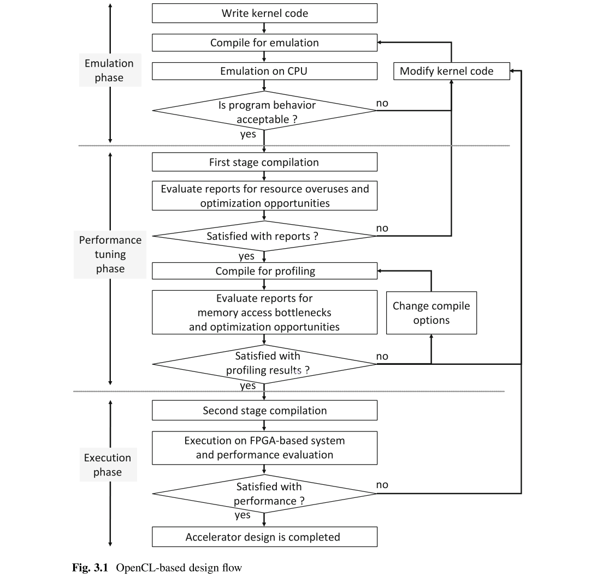

## 3.2 Emulation Phase

为了验证OpenCL内核代码的行为，您可以在CPU上对其进行仿真。如果未观察到所要行为，则必须重新编写代码并再次进行仿真。为了进行仿真，您必须使用以下命令来编译代码。

```bash
aoc -march=emulator <kernel_code>.cl -o <emulate_binary>.aocx
```

FPGA内核代码为`<kernel_code>.cl`，编译的二进制文件是`<emulate_binary>.aocx`。请注意，仿真编译可以在很短的时间内完成，通常需要几秒钟到几分钟的时间。主机代码使用任何C编译器（例如gcc）进行编译。要执行已编译的二进制文件，必须使用以下命令，其中已编译的二进制文件的名称为`<host_binary>`。

```bash
CL_CONTEXT_EMULATOR_DEVICE_ALTERA=1 ./<host_binary>
```

请注意，尽管您不需要FPGA板，但是您需要使用BSP进行仿真。

在仿真中，该代码类似于典型的C代码依次执行。**在仿真中，将忽略并行操作（例如流水线，循环展开和SIMD操作）。因此，仿真时间可能会非常长，您可能无法仿真整个计算**。您可能必须使用少量数据样本进行仿真。请注意，直到OpenCL版本16.1的SDK才能对I/O通道进行仿真。但是，版本17.0提供了一种复制I/O通道行为的方法[2]。

## 3.3 Performance Tuning Phase

在性能调整阶段，**我们分析编译报告以查找由串行执行，较大的启动间隔等引起的性能瓶颈**。我们还可以分析代码以查找信息，例如运行时的内存访问带宽。利用这些信息，我们可以修改代码以获得更好的性能[4，5]。本节说明如何查看和了解编译报告和性能分析结果。

### 3.3.1 Reviewing the Compilation Reports

FPGA的OpenCL使用两阶段编译过程。在**性能调整阶段**的**第一阶段编译**中，**内核代码被转换为HDL代码**。在编译期间，将生成编译报告。第一阶段的编译是通过以下命令完成的，其中内核代码为`<kernel_code>.cl`，输出为`<intermediate_binary>.aoco`。

```bash
aoc -c <kernel_code>.cl -o <intermediate_binary>.aoco
```

编译报告因OpenCL版本的SDK而异。在16.0版之前，编译报告由`<kernel_name>.log`给出。其中`<kernel_name>`是内核文件名。从版本16.1开始，编译报告由`report.html`给出。尽管我们使用`report.html`解释报告信息，您可以在`<kernel_name>.log`中找到相同的信息。

图3.2显示了`report.html`的屏幕截图。视图报告窗格(view reports pane)显示在顶部。在视图报告窗格中，可以选择几种类型的报告，例如循环分析报告，估计的资源利用率报告等。选择其中一个报告后，它会显示在分析窗格(analysis pane)中。在分析窗格的右侧，您可以看到显示内核代码的源代码窗格( source code pane)。详细信息窗格(details pan)可在底部看到，并显示详细的报告信息。

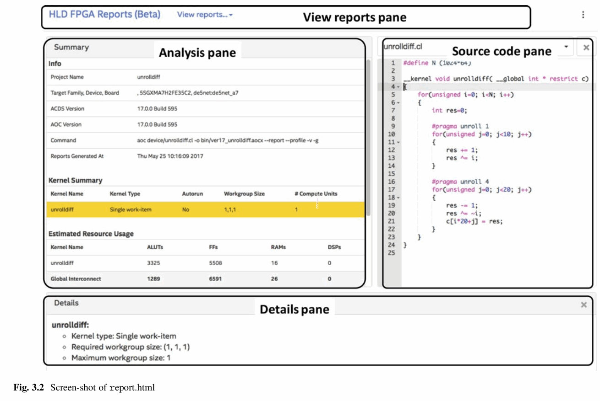

#### 3.3.1.1 Loop Analysis Report

图3.3显示了循环分析报告的屏幕截图。它显示循环分析信息，例如流水线信息，瓶颈，启动间隔（II），展开信息等。底部的详细信息窗格显示了详细说明。例如，由于数据相关性瓶颈，循环分析报告显示7个周期的迭代间隔（II）。在详细信息窗格中，它表明内核代码第9行中的浮点加操作是造成瓶颈的原因。如何克服这种瓶颈将在Sect.4.4中进行说明。

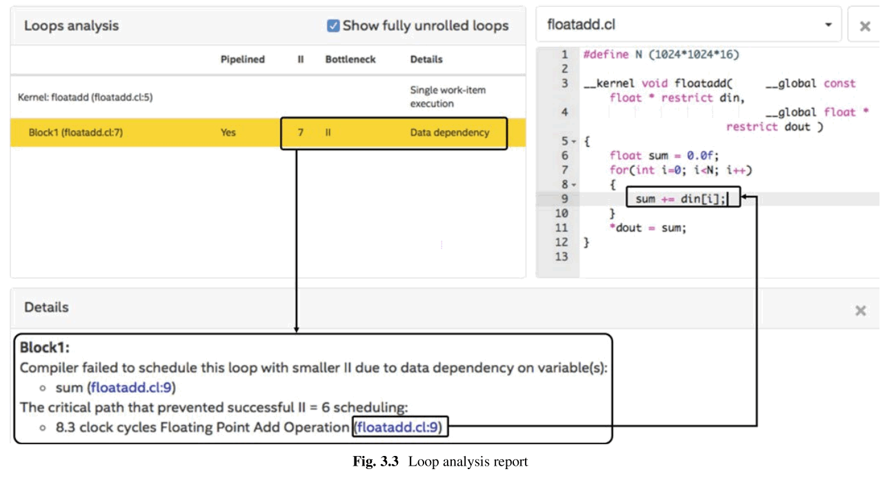

#### 3.3.1.2 Estimated Resource Utilization Reports

估计的资源利用信息可在两种类型的报告中使用，如图3.4所示。一是系统面积分析。系统面积分析的一个例子如图3.4a所示。在此报告中，内核表示为块的组合。这些块与Sect.3.3.1.3中介绍的系统查看器中的块相对应。**显示每个块的资源利用率**。另一个报告是源码区域分析，图3.4b显示了一个示例。该报告**提供了与每个内核代码行相对应的资源利用信息**。

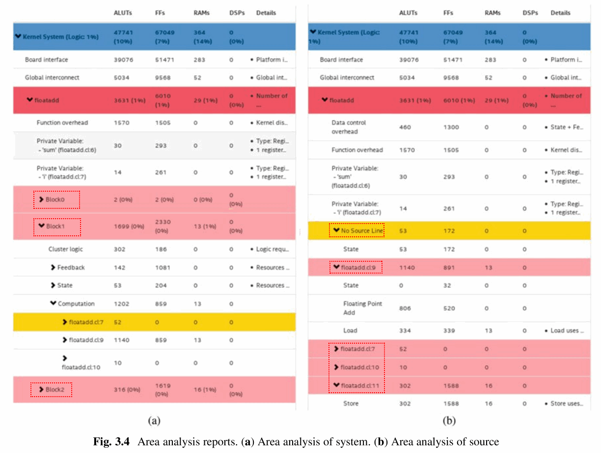

#### 3.3.1.3 System Viewer

**系统查看器显示了FPGA加速器的结构**。它将内核显示为块的组合。我们可以看到如何连接这些块以构建内核，以及如何连接多个内核以构建加速器，如图3.5所示。系统查看器使您可以查看点击的块的信息，例如内存访问宽度，延迟和合并。如果有一个红色背景的块，则表明该块包含性能瓶颈。

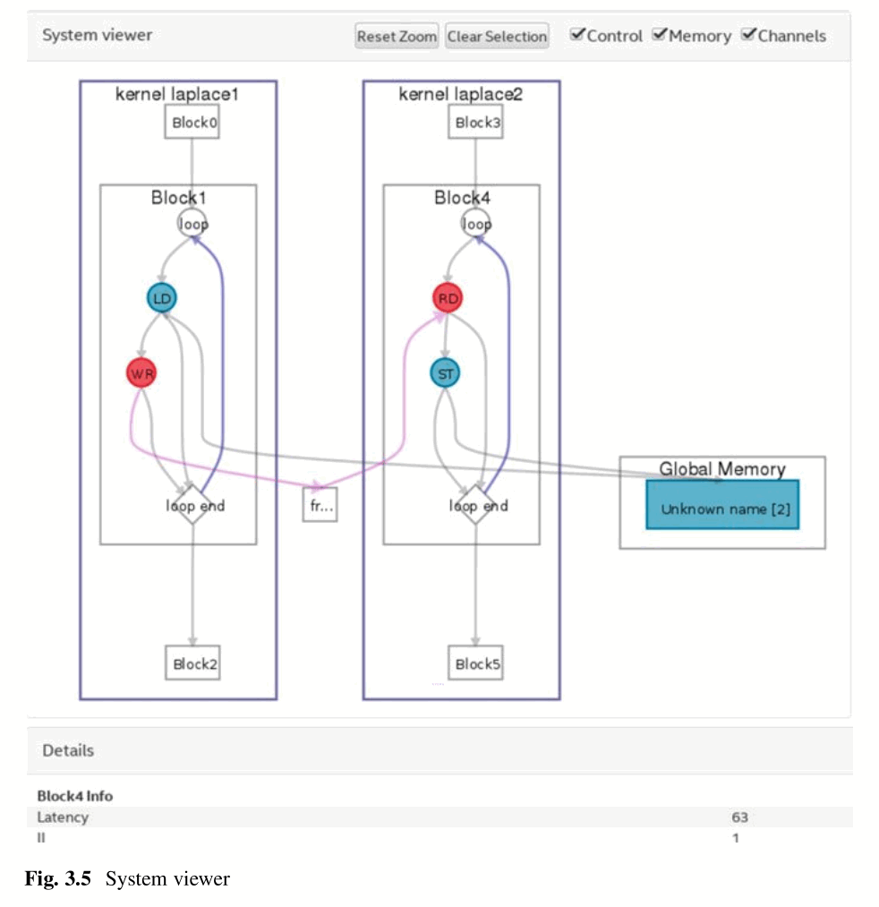

### 3.3.2 Profiling

对内核进行性能分析可用于**分析内存访问**的行为。您可以通过在编译命令中添加`--profile`选项来编译内核以进行性能分析。使用此选项进行编译会在FPGA中生成性能计数器，以在运行时获取内存访问信息。执行内核时，**分析结果**存储在配置文件`profile.mon`中。请注意，当编译内核进行性能分析时，其时钟频率可能低于不使用`--profile`选项编译的同一内核的时钟频率。因此，**如果要评估处理时间，请不要使用`--profile`选项**。

您可以使用“动态分析器”软件**评估分析结果**。调用动态事件探查器的命令取决于OpenCL版本的SDK。对于16.1之前的版本，请使用以下命令。

```bash
aocl report <compiled_binary>.aocx profile.mon
```

从17.0开始，使用以下命令。

```bash
aocl report <compiled_binary>. aocx profile.mon <kernel_file>.cl
```

OpenCL内核代码由`<kernel_file>.cl`指定，编译后的二进制输出为`<compiled_binary>.aocx`。

图3.6显示了动态事件探查器的屏幕截图。它包含标题，源代码选项卡和内核执行选项卡。标头显示板名称和全局内存带宽。全局内存带宽是每种内存类型可用的最大理论带宽。**源代码选项卡显示内存和通道访问的分析结果**。内核执行选项卡显示了**内核执行和数据传输的时序图**。图3.6，选择了源代码选项卡。

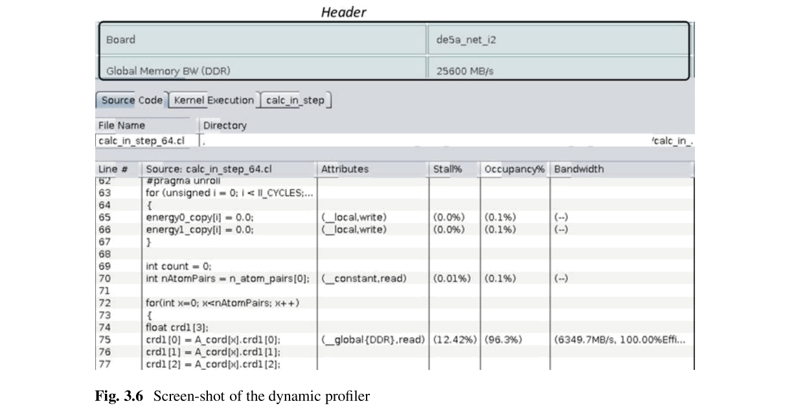

#### 3.3.2.1 Source Code Tab

源代码选项卡中显示的分析结果由四列组成：属性列，停顿百分比列，占用百分比列和带宽列。

**属性列**

此列显示**内存类型（本地，全局等）和访问类型（读或写）**。如果在一个源代码行中有多个内存或通道操作，则这些信息将显示在下拉列表框中。当您将鼠标指针移到这些信息上时，将显示工具提示，如图3.7所示。

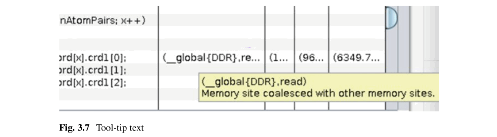

您可以在工具提示文本中看到以下信息。


tool-tips | 说明 
---------|----------
 缓存命中率 <br> Cache hit percentage | 这显示了使用缓存的全局内存访问百分比。**高缓存命中率会降低内存带宽利用率**。
 未对齐访问 <br> Unaligned access | 这显示了未对齐的全局内存访问的百分比。未对齐的访问效率低下。
 合并访问 <br> Coalesced access | 这显示load或store操作是否合并。内存合并将连续地址的多个内存访问合并为一个访问。

**停顿百分比列**

这是由于内存或通道访问而导致流水线停滞的时间百分比。

**占用百分比列**

**占用率是指内存（或通道）访问所需的时间占总处理时间的百分比**。如果内存或通道操作位于内核代码的关键路径中，并且占用率较低，则表明存在性能瓶颈，因为在硬件中issue工作项或循环迭代。当循环次数较少或工作项较少时，也会出现占用率低的情况。在这些情况下，在大多数内核执行时间内，流水线无法完全填充。如何解释占用率信息在Sect.3.3.3中进行了说明。

当您将鼠标指针移到占用值上时，会出现一个称为活动的工具提示。**活动**是**启用预言通道或内存指令的时间百分比**（即，**条件执行为true时**）。因此，可以具有高占用率和低活动性。

**带宽列**

带宽列显示了内核执行期间的全局内存访问吞吐量。那是内核执行期间访问的总字节数。**总体效率是总使用字节占总访问字节的百分比**。效率显示在图3.6的带宽列中。工具提示显示内存操作的平均突发大小。

#### 3.3.2.2 Kernel Execution Tab

图3.8显示了内核执行选项卡的屏幕截图。它显示了内核执行和主机与设备之间的数据传输的时间表。请注意，必须将环境变量`ACL_PROFILE_TIMER`设置为1才能获取数据传输信息。内核名称表示的其他选项卡显示该特定内核执行的摘要。

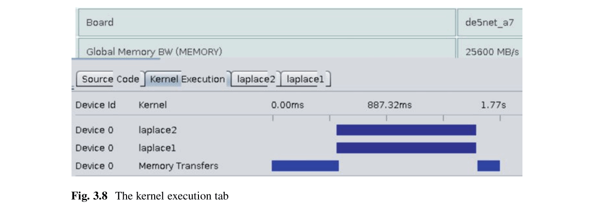

### 3.3.3 Interpreting the Profiling Result

在本节中，我们解释了如何解释性能分析结果以及如何基于此结果提高性能。**内核的理想情况是具有0％的停顿，100％的占用率以及接近理论带宽的内存访问带宽**。但是，即使内存访问带宽很低并且某些循环报告占用率很低，内核也可能是最佳的[3]。

#### 3.3.3.1 High Stall Percentage

较高的停顿百分比**表示流水线由于内存访问瓶颈或通道数据不可用而停顿**。我们解释了**为什么造成停顿以及如何克服这些停顿**。

- 停顿是由于以下原因导致**全局内存数据不可用所致**。
  - **在一个时钟周期内访问大量数据会导致流水线停滞**。如果占用率也很高，则必须减少全局内存访问。这可以通过将**经常访问的数据临时存储在局部内存**中来完成。您还可以使用内存交错将内存访问平均分配给所有内存banks。
  - 对**小数据使用多次内存访问**也可能使流水线停滞。您必须检查是否**合并了内存访问**，因为未合并的访问可能会导致带宽利用效率低下。

  在5.3节中讨论了如何改善全局内存访问。

- 停顿也是由通道数据不可用引起的。由于读写操作之间的不平衡，可能会发生这种情况。例如，如果写通道操作的停顿百分比较高，则读通道操作的占用率和活动性可能较低。在这种情况下，与写通道调用相比，读通道操作的速度太慢。在5.7节中讨论了如何改善通道访问。
- 您可以忽略“停顿率和低占用率”百分比的情况。在这种情况下，内存访问操作属于非关键路径。

#### 3.3.3.2 Occupancy

**非关键路径中的低占用率**

当存储器或通道操作处于**非关键路径中时，可能会发生低占用率**。例如，清单3.1显示了关键路径和非关键路径中的内存访问。在此代码中，两个内部循环以流水线方式并行执行。第一个循环处于关键路径中，因为它具有100次循环迭代。仅十次循环迭代的第二个循环处于非关键路径中。因此，对数组a和c的内存访问应具有较大的占用率，而其余部分应具有较小的占用率。

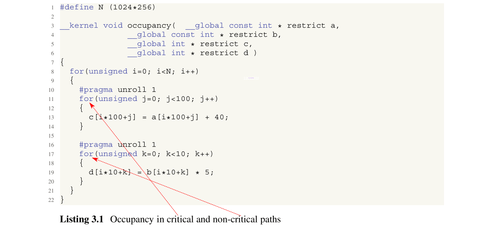

图3.9显示了分析结果。关键和非关键路径内显示的占用率分别为99.1％和10％。由于在非关键路径中不会频繁访问数据，因此占用率很小。如此低的占用率不是问题。

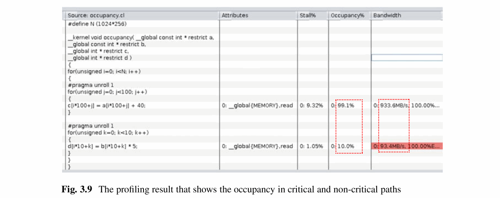

**无停顿，低占用率和低带宽**

如果内存操作位于内核代码的关键路径中，并且该内存操作的占用率较低，则**原因**可能是**数据依赖**性导致的串行执行。清单3.2中的代码在数组b中具有内存依赖性。

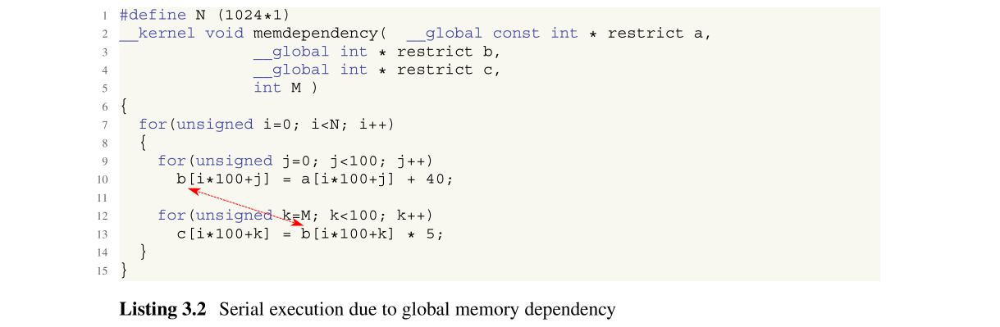

这将导致串行执行，因此占用率和带宽减小，如图3.10所示。如何解决此问题在Sect.4.4中进行了说明。

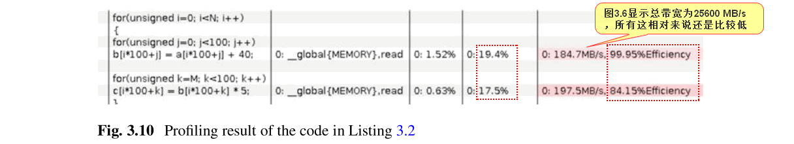

**无停顿，高占用率和低带宽**

图3.11显示了一个编译报告，它没有停顿，占用率高和带宽低且效率高的特点。由于没有停顿并且占用率很高，因此可以说内核性能很好。但是，**如果内存访问带宽较低，则有很大的空间可以进行更多数据访问**。因此，您可以通过并行访问和处理更多数据来**提高并行度**。这可以通过使用SIMD向量化或循环展开来完成。您还可以使用更多计算单元或更多并发内核。但是，您需要更多的资源来执行更多的并行操作。第4章中介绍了如何提高并行度。

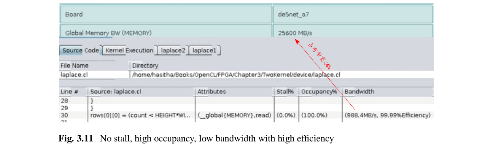

#### 3.3.3.3 Low Bandwidth Efficiency

当有用数据的数量比访问的数据少时，带宽效率就会降低。这通常发生在随机访问，跨步访问等情况下。为了提高效率，您必须访问连续的内存地址。

## 3.4 Execution Phase

为了获得执行的配置数据，您必须进行第二阶段编译。您可以使用以下命令进行第二阶段编译。

```bash
aoc <intermediate_binary>.aoco -o <bit-stream>.aocx
```

输入是在第一阶段中生成的`<intermediate_binary>.aoco`文件。输出是`<bit-stream>.aocx`文件，该文件用于配置FPGA。您可以使用`<kernel_code>.cl`文件作为输入，按如下所示进行完整编译（第一阶段和第二阶段相结合）。

```bash
aoc <kernel_code>.cl -o <bit-stream>.aocx
```

编译内核后，您可以在**基于FPGA的计算系统上执行它并评估处理时间**。您还可以使`acl_quartus.log`文件评估实际资源使用情况和时钟频率。该文件在第二阶段编译后生成。如果您对性能或资源利用率不满意，可以重新编写内核代码，如图3.1所示。请注意，请勿将使用`--profile`选项编译的内核用于最终执行，因为它们的时钟频率可能会非常低。

## 3.5 Summary

表3.1列出了不同阶段的可用报告摘要。

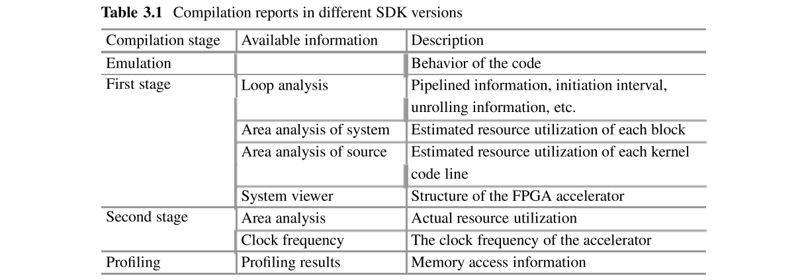