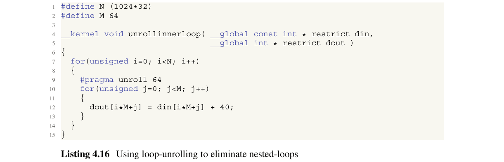
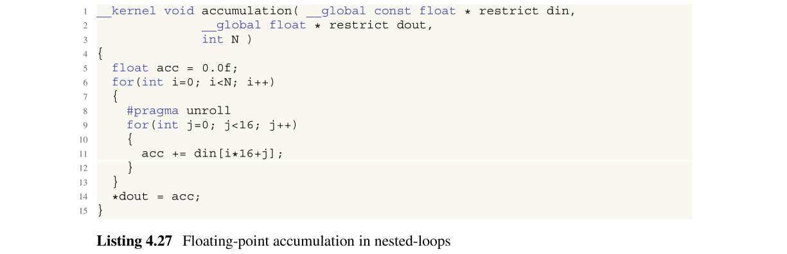

# Ch4 FPGA-Oriented Parallel Programming

## 4.1 Overview ofNDRange Kernels and Single-Work-Item Kernels

适用于FPGA的OpenCL使用两种类型的内核：**NDRange内核和单工作项(single-work-item)内核**[1、2]。单工作项内核也称为**任务内核**。NDRange内核有许多工作项，而单工作项内核只有一个。NDRange和单一工作项内核之间有两个主要区别。
- **第一个区别**是编程风格。NDRange内核使用类似于**GPU**的编程风格，其中使用全局和本地工作项ID并行处理多个工作项。单工作项内核使用类似于**CPU**的编程样式，在整个内核执行过程中，仅处理一个工作项。
- **第二个区别**是数据共享方法。NDRange内核通过使用**本地内存**在多个工作项之间共享数据。单工作项内核通过使用**私有内存**在多个循环迭代之间共享数据。最近，有很多基于NDRange内核[3-5]和单工作项内核[6、7]的FPGA加速器的作品。

### 4.1.1 NDRange Kernel

NDRange内核由多个工作项执行。工作项彼此间隔一个周期地启动，并以流水线方式进行处理。清单4.1显示了用于矢量加法的NDRange内核代码。


脱机编译器为此内核生成流水线式数据路径，如图4.1a所示。图4.1b显示了计算的时序表。在第一个周期中，启动工作项1并从内存中加载数据。在下一个周期中，工作项2启动并加载数据，而工作项1执行加操作。在下一个周期中，启动工作项目3并加载数据。同时，工作项2执行加法，而工作项1存储数据。因此，三个工作项目在不同阶段并行执行。


如图4.1b所示，尽管NDRange内核代码与GPU代码非常相似，但执行方式与GPU的执行方式却大不相同[8]。在GPU中，工作项同时启动并**以单指令多数据（SIMD）方式执行**。即，多个工作项针对**不同的数据同时执行相同的操作**。另一方面，在FPGA中，以流水线方式依次启动和执行工作项。结果，工作项针对**不同的数据同时执行不同的操作**。因此，NDRange内核的行为类似于**多指令多数据（MIMD）计算**，与GPU的行为有很大不同。注意，可以在FPGA中使用SIMD计算，这将在Sect.4.3.2中讨论。

**当工作项之间存在数据依赖性时，应共享其数据**。数据共享可以通过本地或全局内存完成。您可能必须使用屏障函数来确保正确的执行顺序。工作组中的所有工作项都必须先执行此函数，然后才能继续执行。由于FPGA使用流水线，因此与GPU相比，等待所有工作项执行屏障函数的代价非常高。

### 4.1.2 Single-Work-Item Kernel

单工作项内核的实现与C程序非常相似。一个工作项内核包含多个循环，每个循环都有许多循环迭代。在不同的流水线阶段并行计算多个循环迭代，称为**循环流水线**。结果，我们可以利用流水线级并行。

清单4.2显示了用于向量加法的单工作项内核代码。对于单工作项内核，循环迭代被用作内核的执行单元。


脱机编译器生成流水线数据路径，如图4.2a所示。图4.2b显示了计算的时序表。在第一个周期中，循环迭代1启动，它从内存中加载数据。在下一个循环中，启动循环迭代2并加载数据，同时循环迭代1执行加法。在下一个循环中，将启动循环迭代3并加载数据。同时，循环迭代2执行加法，而循环迭代1存储数据。在此阶段，在不同的流水线阶段并行执行三个循环迭代。


尽管单工作项和NDRange内核的代码不同，但是它们的数据路径和**执行方式非常相似**，如图4.1和4.1所示。这是因为NDRange的工作项之间和单个工作项内核的循环迭代之间**没有数据依赖性**。如果存在数据依赖性，则两种内核的行为是不同的。对于单工作项内核，程序员无需执行任何特殊操作即可保留数据依赖性。【注：sum += a[i] + b[i] 之类的依赖计算；上一个迭代在第二周期算完，下一个迭代就可以在下一周期add中使用，如果计算时间长，流水线的II会加长。】对于NDRange内核，需要使用屏障函数来保留工作项之间的数据依赖性，如Sect.4.1.1中所述。

### 4.1.3 Summary of Differences

在NDRange内核中，工作项以流水线方式并行执行。在单工作项内核中，循环迭代以流水线方式并行执行。当没有数据依赖时，两个内核都提供非常相似的结果。当存在数据依赖性时，与NDRange内核相比，单工作项内核易于使用并且可能提供更好的性能。

在以下情况下，可以使用NDRange内核。

- 当工作项之间没有数据共享时。
- 存在非常特殊的数据共享模式时，例如DFT（离散傅里叶变换）[9]中的模式。
- 当您想在FPGA和GPU中使用相同的内核代码时。

在以下情况下，可以使用单工作项内核。

- 存在数据依赖性时。
- 当您要将典型的CPU代码移植到FPGA上时。

请注意，单工作项内核在GPU上的运行情况极差。由于只有一个工作项，因此仅使用一个GPU内核串行执行代码。

## 4.2 Performance-Improvement Techniques _Common_ to Single-Work-Item and NDRange Kernels

### 4.2.1 When and Where to Use Loop Unrolling

循环展开是提高并行度的非常重要的方法。展开循环允许在**一个时钟周期内处理更多数据**。它以**增加资源利用为代价减少了循环迭代的次数**。要展开循环，使用`#pragma unroll <N>`指令，其中展开因子由`<N>`给出。如果未指定展开因子，则脱机编译器将尝试完全展开循环。重要的是要记住，即使没有`#pragma unroll`指令，脱机编译器也可能展开循环。

FPGA上的循环展开实现与GPU完全不同。在FPGA中，展开**不仅仅是删除循环索引操作**。通过应用更多并行操作，它将显著改变内核的结构。结果，尽管提高了性能，但是资源利用却可以很大。

清单4.3显示了循环展开的示例。内循环完全展开。结果，可以并行处理内循环中的八个循环迭代。


表4.1显示了使用循环展开和不使用循环展开的处理时间的比较。当使用几乎相同的时钟频率进行循环展开时，处理时间减少到11.25％。


展开循环时，应考虑以下几点。

- 循环展开不仅会增加资源利用率，而且会增加所需的内存带宽。因此，如果内核是内存受限的，则必须减小展开因子。
- 由于资源利用率高，使用较大的展开因子可能会降低时钟频率。如果时钟频率较低，则必须考虑降低展开系数。
- 如果资源利用率过高，则必须停止自动展开。这可以通过使用`#pragma unroll <N>`指令来完成。如果展开系数为1，则不会展开循环。
- 展开嵌套循环结构的外部循环可能会大大提高资源利用率。因此，最好先展开内部循环。

在以下情况下，脱机编译器可能无法实现循环展开。
- 当内核由于资源利用率高而无法放入FPGA中时。
- 循环边界不是常数时。
- 当循环包含编译时未知的复杂控制流时。

### 4.2.2 Optimizing Floating-Point Operations

#### 4.2.2.1 Re-ordering Floating-Point Operations

脱机编译器完全按照代码中的说明执行浮点运算。结果，该实现与IEEE标准754-2008一致。最终结果与相同代码的CPU实现相匹配。图4.3中的Scheduled DFG显示了清单4.4的浮点计算。计算的Latency为四个时钟周期。


如图4.4所示，可以通过浮点运算的平衡树来实现更高效的硬件。这是通过使用编译选项`--fp-relaxed`完成的，如下所示。


```bash
aoc --fp-relaxed <kernel_file>.cl
```

就Latency而言，此实现比图4.3中所示的实现更为有效。但是，**由于重新排序浮点运算，在两种实现中，计算结果可能有所不同**。【注：浮点运算与顺序相关，整数运算与顺序无关，也就是结合律交换律之类的问题浮点数不可用】

#### 4.2.2.2 Using Fused Floating-Point Operations

脱机编译器根据IEEE标准754-2008应用舍入运算。但是，这可能需要大量的硬件资源。如果应用程序可以忍受浮点结果的微小差异，则可以通过使用编译选项`--fpc`进行融合的浮点运算来减少舍入运算，如下所示。

```bash
aoc --fpc <kernel_fileneme>.cl
```

此选项指示脱机编译器仅在计算结束时才舍入浮点运算。在中间步骤中，将使用具有附加精度位的结果进行计算。在最后一步，将删除其他精度位以舍入结果。**此方法可能不符合IEEE标准754-2008，但可能具有更好的数值精度**。

### 4.2.3 Optimizing Fixed-Point Operations

与浮点计算相比，定点计算使用的资源更少。因此，最好尽可能使用定点计算。定点计算的可用数据类型只有char(8位)，short(16位)，int(32位)和long(64位)。因此，不可能用任意宽度表示数据类型。例如17位数据。但是，您可以使用位掩码来指示编译器执行优化，以实现所需的硬件类型。清单4.5允许离线编译器实现一个17位加法器以加两个17位数据。结果也保持在18位宽。


### 4.2.4 Optimizing Vector Operations

使用内置向量类型的向量操作对于合并内存访问非常重要，如Sect.5.3中所述。更新向量类型的一个元素时，请更新所有元素。如果不需要这种更新，则可以使用清单4.6中所示的dummy值进行更新。这会得到简单的硬件结构，并降低了资源利用率。


### 4.2.5 Other Optimization Techniques

尽可能在指针参数中插入`restrict`关键字。这样可以防止脱机编译器在不冲突的加载和存储操作之间创建不必要的内存依赖关系。`restrict`关键字通知离线编译器该指针不是其他指针的别名。例如，如果您的内核有两个指向全局内存的指针，**A和B永不重叠**，则按以下方式声明内核。

```c
__kernel void myKernel (__global int * restrict A, __global int * restrict B)
```

请注意，在指针的别名指针上插入`restrict`关键字可能会导致错误的结果。

**避免使用昂贵的运算（例如整数除法和模运算）可能会降低资源利用率**。模运算通常用于计算x, y, z坐标。您可以使用多个计数器来计算x, y, z，而不是进行模运算。除加，乘，绝对值和比较外，大多数浮点运算都很昂贵。如果在内核中仅几次调用了昂贵的函数，则可以**预先计算这些数据并存储在内存中**。

## 4.3 Performance-Improvement Techniques for NDRange Kernels

### 4.3.1 Specifying the Work-Group Size

您可以在内核代码中指定工作组大小，以使脱机编译器执行积极的优化。有两种方法可以指定工作组的大小。一种方法是指定“最大工作组大小”。另一种方法是指定“所需的工作组大小”。

#### 4.3.1.1 How to Specify the Maximum Work Group Size

通过使用属性`max_work_group_size(N)`来指定最大工作组大小，其中`N`是工作项数。清单4.7中的示例将最大工作组大小设置为`128`。


为了执行此内核，您应该在主机代码中执行以下操作。函数`clEnqueueNDRangeKernel`的参数`local_work_size`必须设置为小于或等于最大工作组大小的值。否则，函数`clEnqueueNDRangeKernel`的调用将失败，并报告错误`CL_INVALID_WORK_GROUP_SIZE`。

#### 4.3.1.2 How to Specify the Required Work-Group Size

通过使用属性`reqd_work_group_size(X, Y, Z）来指定所需的工作组大小。清单4.8中的示例将所需的工作组大小设置为(64, 1, 1)。


为了执行内核，您应该在主机代码中执行以下操作。主机代码中的函数`clEnqueueNDRangeKernel`的参数`local_work_size`必须设置为与所需工作组大小指定的值相同。否则，函数`clEnqueueNDRangeKernel`的调用将失败，并报告错误`CL_INVALID_WORK_GROUP_SIZE`。

### 4.3.2 Kernel Vectorization

**为了获得更高的吞吐量，可以使用内核向量化**。它允许以SIMD方式执行多个工作项。**在内核向量化中，脱机编译器将多个标量运算（加法，乘法等）组合为一个向量运算**。由于以SIMD方式同时完成更多操作，因此需要更多资源。此外，每个时钟周期可能需要更多数据，并增加了所需的内存带宽。当您继续增加SIMD大小时，内核将变得受内存限制，并且性能达到饱和。

#### 4.3.2.1 Automatic Vectorization

如清单4.9所示，使用`num_simd_work_items(N)`属性可以使脱机编译器向量化相同类型的N个操作。它必须与`reqd_work_group_size`属性一起使用。SIMD大小必须是2的倍数（即2、4、8、16等），并且**必需的工作项数必须可以被SIMD大小整除**。清单4.9显示了使用四个SIMD通道进行自动向量化的示例。工作项均匀地分布在SIMD通道中。与没有向量化的内核相比，该内核执行的工作多四倍。


**由于四个加载操作访问全局存储器中的连续位置，因此脱机编译器将四个加载合并为单个更宽的向量加载**。这种优化减少了对内存的访问次数，并有可能导致更好的内存访问模式。如果**内存访问依赖于数据或在编译时未知**，则脱机编译器将**不会合并内存访问**。

#### 4.3.2.2 Manual Vectorization

清单4.10显示了如何手动向量化内核。内核在四个SIMD通道中执行四个加法。因此，与没有向量化的内核相比，所需的工作项数仅为1/4。结果，您必须修改主机代码以使用这种数量的工作项。


#### 4.3.2.3 Using Vector Data Types

您可以使用清单4.11所示的向量数据类型来增加每个时钟周期的计算量。通过将四个加载（和存储）操作合并为一个加载（和存储）操作，减少了内存访问的数量。内存访问合并在Sect.5.3.1中详细说明。


### 4.3.3 Increasing the Number ofCompute Units

多个计算单元可用于实现更高的吞吐量。脱机编译器将**每个计算单元实现为唯一的流水线**。**多个计算单元同时执行多个工作组**。由于工作组是在一个计算单元中执行的，因此您必须在宿主代码中声明足够的工作组才能利用所有计算单元。FPGA中的硬件调度程序会自动将工作组分派到可用的计算单元。

计算单元的数量由`num_compute_units(N)`属性设置，如清单4.12所示。计算单元数量的增加会增加资源使用率和所需的内存带宽。


表4.2显示了不同优化方法的处理时间的比较。属性`reqd_work_group_size`设置为(64, 1, 1)，并且所有方法都使用相同的NDRange。与没有优化相比，**对于不同的SIMD向量化方法，我们的速度提高了近四倍**。但是，使用四个计算单元的加速仅为1.6倍。**原因是在使用多个计算单元时非合并访问内存**。由于多个计算单元独立运行，因此所有单元都争夺全局内存访问权限。这可能会导致非合并的内存访问。


### 4.3.4 Combining Kernel Vectorization with the Use of Multiple Compute Units

内核向量化和使用多个计算单元都可以通过在一个时钟周期内进行更多的计算和访问更多的数据来提高吞吐量。内核向量化增加了单个计算单元内SIMD操作的数量，如图4.5a所示。相同工作组的工作项以SIMD方式执行。SIMD操作使用相同的指令，以便共享控制逻辑。由于仅使用一个计算单元，因此存在一条通往全局内存的宽数据路径。图4.5b显示了多个计算单元的使用。两个计算单元同时执行两个工作组。每个计算单元都有其自己的数据路径来访问内存。


与使用多个计算单元相比，以下是使用内核向量化的优势。
- 由于共享了控制逻辑，因此资源利用率较小。
- 内存访问高效且合并。这减少了内存访问的次数。

与多个计算单元相比，以下是使用内核向量化的缺点。
- SIMD向量化大小限制为2的倍数。结果，资源使用可能无法得到充分利用。

为了最大化性能，可以将内核向量化与使用多个计算单元结合使用，以充分利用资源。让我们考虑一个具有八个SIMD通道的内核的示例，该内核每个时钟周期执行八次操作。我们假定由于资源限制，我们不能将SIMD通道数增加到16。相反，我们可以编写一个如清单4.13所示的内核代码，该代码使用三个计算单元，每个计算单元具​​有四个SIMD通道。


该内核的实现如图4.6所示。每个时钟周期提供12次操作。与具有八个SIMD通道的内核相比，此实现可在每个时钟周期执行更多操作。


## 4.4 Performance-Improvement Techniques for Single-Work-Item Kernels

为了提高单工作项内核的性能，应执行以下操作。

- 为所有循环实现流水线。
- 以1的启动间隔（II）实现内核，其中启动间隔为`loop-iteration-launch-delay`。

如4.1节所述。单工作项内核实现了循环流水线。为了保留循环迭代之间的数据依赖性，脱机编译器可能会增加II甚至降低时钟频率。本节说明如何避免这种情况，以及如何优化内核以实现最佳性能。

### 4.4.1 Avoiding Nested Loops

清单4.14显示了一个嵌套循环结构。由于**外循环索引用于内循环的计算**，因此脱机编译器假定外循环必须等待直到内循环完成。图4.7显示了清单4.14的编译报告。它表明外循环迭代至少间隔两个周期启动。由于在内循环中有N个循环迭代，因此外循环的II为`N+2`个循环。额外的两个周期延迟是由嵌套循环的控制开销引起的。


可以通过将循环结构重新排列为单个大循环来消除额外的两个循环延迟，如清单4.15所示。根据编译报告，循环迭代在每个周期中启动。


表4.3显示了嵌套循环实现（清单4.14）和单循环实现（清单4.15）的处理时间的比较。嵌套循环结构的内部循环包含16,384个循环迭代。使用Terasic DE5 FPGA板[10]进行比较。使用Intel FPGA SDK for OpenCL 16.0编译内核。两种实现之间没有太大差异。由于两种实现的时钟频率都相同，因此我们可以直接比较时钟周期数。由于内部循环包含大量循环迭代，因此可以忽略额外两个时钟周期的延迟。如果内部循环只有几个循环迭代，则由于两个周期的延迟，我们可能会看到很大的差异。


与嵌套循环实现相比，**单循环实现可能具有更高的时钟频率**。表4.4显示了清单4.2中所示的向量加法示例的嵌套循环和单循环实现的处理时间的比较。与嵌套循环实现相比，单循环实现具有更高的时钟频率，因此处理时间更短。对于较大的内核，单循环实现的频率往往较高，因此**最好避免使用嵌套循环**。


循环展开可用于消除嵌套循环结构。清单4.16显示了完全展开内部循环以消除嵌套循环结构。



图4.8中的编译报告显示，循环迭代在每个循环中启动。如果内部循环中的迭代次数很小，则很容易展开它。请记住，循环展开会增加资源利用率和所需的内存带宽。


有关更多信息，可以参考[11]中的工作，它解释了如何预测嵌套循环结构中的时钟周期数。它使用编译报告来查找并行处理的循环和串行处理的循环。使用此信息和每个循环中的循环迭代次数，可以预测时钟周期数。

### 4.4.2 Avoiding Serial Executions Due to Data Dependency

清单4.17显示了带有嵌套循环的内核代码，该代码计算整数之和。内循环中第12行的计算使用第14行中的计算结果。类似地，第14行中的计算使用第12行中的计算结果。结果，内循环中的计算（来自第10至13行）和第14行中的计算必须以串行方式完成。


图4.9中的编译报告显示“循环迭代在数据相关区域中串行执行”。


清单4.18显示了如何解决此数据依赖问题。从内部循环中删除变量sum，并使用新的变量tmpsum代替。现在，可以以流水线的方式重叠内循环中的计算和第15行中的计算。


清单4.18的编译报告如图4.10所示。串行执行区消失了，循环成功进行了流水线处理。此外，根据编译报告，迭代至少间隔两个周期启动。


这是因为在Sect.4.4.1中说明了嵌套循环结构，并且与数据依赖性没有任何关系。

表4.5显示了串行和并行执行的处理时间的比较。评估使用了Terasic DE5 FPGA板[10]和Intel OpenCL 16.0 FPGA SDK。清单4.18的处理时间比清单4.17的处理时间略短。


图4.11a显示了清单4.17中计算的时间表。内循环的计算和14行的计算是串行进行的。与第14行相比，该内循环具有1024次循环迭代，并且计算时间较长，这只是一个操作。图4.11b显示了清单4.18中计算的时间表。内循环中的计算和第15行的计算是并行进行的。


让我们考虑另一个例子。清单4.19显示了具有两个内部循环的嵌套循环结构。在两个循环中更新变量和。第17行的计算需要第12行的计算结果。类似地，第12行的计算需要第17行的计算结果。因此，**两个内部循环都是串行执行的**。


清单4.20显示了如何解决这个问题。在内部循环中删除了变量sum，并使用了新变量tmpsum1和tmpsum2。因此，内循环的计算不需要彼此的结果。结果，**内部循环以流水线方式并行执行**。


表4.6显示了串行执行（清单4.19）和并行执行（清单4.20）的处理时间的比较。评估使用了Terasic DE5 FPGA板[10]和Intel OpenCL 16.0 FPGA SDK。清单4.20的处理时间仅为清单4.19的48％。


图4.12a显示了清单4.19的时间表。两个内部循环中的计算是串行进行的。图4.12b显示了清单4.20的时序表。两个内部循环中的计算是并行进行的。由于两个内部循环的循环迭代次数相同，因此并行执行它们会大大减少处理时间。


### 4.4.3 Reducing Initiation Interval for Reduction Operations

由于循环迭代之间的数据依赖性，启动间隔大于用于归约操作的一个时钟周期。对于归约操作的示例，让我们考虑清单4.21所示的浮点值的总和。通过将din[i]加到其当前值，可在每次循环迭代中更新变量sum。因此，每个添加操作都需要其先前操作的结果。浮点加法的Latency为几个时钟周期。结果，每个加操作必须等待几个时钟周期，直到上一个操作完成。


清单4.21的编译报告如图4.13所示。它报告每8个时钟周期启动一次循环迭代。换句话说，启动间隔为8。图4.14显示了清单4.21的调度数据流图（SDFG）。


为了缩短启动间隔，可以使用八个部分和，如图4.15所示，并并行执行它们，如图4.16所示。


清单4.22显示了对应于图4.16的内核代码。第8行声明了一个移位寄存器，用于存储八个部分和。在第15-25行中，部分和是并行计算的。在第28-31行中，部分和的结果相加。


作为图4.15中部分和数的值，我们使用了**启动间隔8**，该间隔是从图4.13的编译报告中获得的。但是，这种确定部分和数的方法并不总是最好的。表4.7显示了不同数量的部分和的处理时间。每行对应于具有一定数量的部分和的实现。随着部分和的数量变大，处理时间减少。为了获得最佳设计，我们应该选择处理时间最少的设计。


### 4.4.4 Reducing Initiation Interval Due to Read-Modify-Write Operations to Global Memory

由于全局内存访问的Latency非常长，因此对全局内存的读-修改-写操作会导致性能显着下降。清单4.23显示了对全局存储器进行读-修改-写操作的示例。


清单4.23的编译报告如图4.17所示。启动间隔为324个周期，非常大。


我们**可以通过将全局内存数据处理到片上内存（本地/私有内存）中来缩短启动间隔**，因为与全局内存相比，片上内存的Latency要短得多。处理完全局存储器数据后，使用片上存储器进行计算。清单4.24显示了此计算的内核代码。


编译报告如图4.18所示，初始化间隔为2。


表4.8显示了处理时间比较。由于324的启动间隔减少到仅2，因此改进非常重要。请注意，脱机编译器显着降低了时钟频率，每两个周期启动一次循环迭代。总的来说，处理时间减少到9％。

该方法适用于数据足够小以存储在片上存储器中的情况。例如，即使在诸如Stratix V和Arria 10之类的高端FPGA中，FPGA的片上存储器的大小也只有几十兆字节。因此，只有一小部分数据可以复制到片上存储器中。但是，您可以通过重复使用相同的片上存储器来重复此过程。


### 4.4.5 Ignore Loop-Carried Dependencies Due to Read-Modify-Write Operations

如果另一个循环迭代不需要更新的数据，则可以启动下一个循环迭代，而无需等待先前迭代的数据写入全局内存。在这种情况下，可以使用`#pragma ivdep`指令指示脱机编译器忽略依赖关系，如清单4.25所示。


清单4.25的编译报告如图4.19所示。启动间隔为1。请注意，程序员在使用`ivdep`时必须绝对确保没有数据依赖性。否则，将产生错误的结果。


表4.9显示了清单4.23、4.24和4.25的处理时间的比较。与其他方法相比，清单4.25的处理时间非常短。处理时间减少的原因是较高的时钟频率和较小的启动间隔。


### 4.4.6 Implementing a Single-Cycle Floating-Point Accumulator

在较旧的Stratix V FPGA和较新的Arria 10 FPGA之间，累加运算的实现有很大不同。清单4.26显示了一个简单的累加操作。我们使用Stratix V FPGA [10]为Terasic DE5-Net FPGA开发套件和带有Arria 10 FPGA [12]的Terasic DE5a-Net Arria 10 FPGA开发套件编译了此代码。


编译报告如图4.20所示。Stratix V FPGA的编译报告如图4.20a所示。编译使用OpenCL 16.1 SDK和Quartus Prime标准16.1版本完成。如该报告所示，循环迭代每八个时钟周期启动一次。这是因为在浮点加法运算中存在数据依赖性，这已在Sect.4.4.3中进行了说明。Arria 10 FPGA的编译报告如图4.20b所示。编译使用OpenCL 16.1 SDK和Quartus Prime Pro 16.1版完成。如该报告所示，尽管存在数据依赖性，但每个时钟周期都会启动循环迭代。这是由于Arria 10 FPGA中的单周期累加器功能。


要在Arria 10 FPGA中使用单周期累加器功能，必须满足以下条件。
- 累加操作必须在循环内。
- 累加器必须初始化为零。

清单4.27显示了在嵌套循环中完成的累加。如果未展开内循环，则每个时钟都会启动循环迭代。如果内循环展开，您将获得几个并行的加法。



图4.21显示了清单4.27的编译报告。由于存在并行加，因此每67个时钟周期就会启动循环迭代。


对于Arria 10 FPGA，有两种方法可以解决此问题。一种方法是使用编译标志`--fp-relaxed`。另一种方法是根据清单4.28修改代码。这些方法允许在每个时钟周期启动循环迭代。

