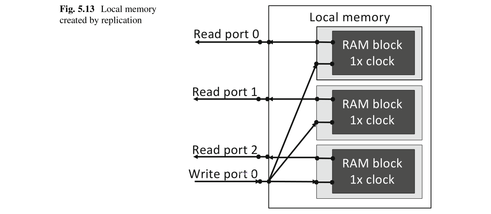

# Ch05 Exploiting the Memory Hierarchy

## 5.1 Overview ofthe Memory Hierarchy

FPGA的OpenCL [1]使用分层存储结构[2，3]，如第1.2.4节中所述。表5.1显示了如何实现不同的内存。**主机内存位于主机中**。**全局内存**是位于FPGA芯片外部**FPGA板上的DRAM**。Constant内存占用用作全局内存的DRAM的一部分。Constant内存的数据**缓存**在FPGA的片上存储器中。**本地和私有存储器都在FPGA芯片上**[4，5]。本地存储器是使用**RAM块**实现的。私有存储器是使用**RAM块和寄存器**来实现的。


## 5.2 Host Memory

主机内存有两种使用方式。**一种方法**是将用于计算的数据存储在主机中。**另一种方法**是存储传输到设备的数据并存储从设备传输的结果。对于后一种方式，应为主机内存分配**64字节对齐**。这样可以在主机和设备之间进行直接内存访问（DMA）传输。以下代码显示如何使用64字节的大小对齐主机内存。

```c
#define AOCL_ALIGNMENT 64
void * data_host = NULL;
posix_memalign (&data_host, AOCL_ALIGNMENT, size) ;
```

## 5.3 Global Memory

图5.1显示了全局内存和内核之间的数据路径。内核通过内存控制器访问全局内存。内存控制器为内核提供了一个简单的接口，同时负责对全局内存的复杂控制。例如，Terasic DE5-Net FPGA开发套件[6]中使用的DDR3存储器以高时钟频率（1600MHz）运行，并具有64位数据总线。存储控制器以较低的时钟频率（200MHz）运行，并具有较宽的（512位）数据总线。


**事务是指对内存的读取或写入访问**。对全局存储器的一次事务处理允许访问一个固定大小的连续区域，该区域的大小由内核和内存控制器之间的总线宽度确定。在此示例中，在一个事务中访问了64个字节（512位）。图5.2显示了4个字节的数据d1和d2存储在相隔超过64字节区域中。要访问d1和d2，我们需要两个事务，即使d1和d2仅为4个字节，每个事务也要加载64个字节。


如果数据位于相隔超过64字节区域中，则需要进行多个事务，如图5.2所示。将多个事务合并为一个称为“内存访问合并” [7]。高效访问内存需要合并。另外，合并简化了内存访问的数据路径。这可能会降低资源利用率并增加时钟频率。

### 5.3.1 Using Array-of-Structures for Coalescing

内置向量类型（例如float2和float4 [8]）可用于合并的内存访问。需要定制数据类型来合并更复杂的访问模式。结构体类型可用于将多个事务合并为一个。例如，清单5.1中的内核每个循环迭代需要8个输入，这导致了非合并的内存访问。


清单5.2显示了如何使用结构体类型将所有输入组合为一个，从而合并内存访问。


表5.2显示了清单5.1中非强制访问和清单5.2中合并访问的处理时间的比较。评估完成了33,554,432次循环迭代，FPGA板是Terasic DE5-Net FPGA开发套件[6]。合并访问的处理时间小于非合并访问的处理时间。由于数据路径更简单，所以合并访问的时钟频率更高。请注意，请勿将`structure-of-array`用于合并。在这种情况下，数组被分配到相隔较远的位置，因此会发生许多事务。


#### 5.3.1.1 How to Align Structures

**结构体元素必须正确对齐以提高性能**。脱机编译器默认情况下根据以下条件[4，5]对齐结构体元素。
- 对齐方式必须是2的幂。
- 对齐方式必须是结构成员字宽大小的最小公倍数。

让我们考虑清单5.3中的示例。内核`myKernel`访问类型为`myStruct`的数组。`myStruct`的成员为1字节宽的“char类型”和4字节宽的“int类型”。


由于最小公倍数字宽为4字节，而4为2的幂，因此结构体是4字节对齐的如图5.3所示。由于char只有1字节宽，因此将插入三个字节的填充以实现4字节对齐。这样会将结构体元素的大小增加到12个字节，而不是原来的9个字节。此外，**某些结构体元素属于多个64字节区域**。由于**需要多个事务来访问这些数据**，因此结构体元素未正确对齐。


图5.4显示了清单5.3的分析结果。访问`myStruct`成员A的效率仅为8.34％。由于在数组字段之间插入填充而降低了效率。由于内存访问效率低，占用率也降低到仅77％。


#### 5.3.1.2 Removing Padding

可以使用`__attribute__((packed))`删除填充，如清单5.4所示。


由于去除了结构体成员之间的填充，因此如图5.5所示，所有成员都被紧密打包。结果，结构体元素的大小为9个字节。尽管减小了大小，但**某些结构体元素属于多个64字节区域**。因此，该结构体未正确对齐。


如表5.3所示，使用非填充结构体的处理时间比使用填充结构体的处理时间小9％。


图5.6显示了删除填充后的分析结果。效率接近100％。尽管占用率也提高到了85.7％，但是由于某些结构体元素属于多个64字节区域，因此结构体仍然未对齐。


#### 5.3.1.3 Aligning and Removing Padding

为了提高性能，我们必须正确对齐结构体元素，以使任何结构元素都属于64个字节的单个事务区域。为此，事务大小必须是对齐大小的倍数。清单5.5显示了通过使用`__attribute__((packed))`和`__attribute__((aligned(N)))`来正确对齐结构体元素的内核代码，其中N是对齐大小（以字节为单位）。


由于64字节的事务大小是16字节的对齐大小的倍数，因此**每个结构体元素都属于单个64字节区域**，如图5.7所示。这**提供了最有效的硬件和有效的内存访问**。


表5.4显示了不同对齐方法的处理时间的比较。与没有填充的未对齐结构相比，使用对齐结构的处理时间要短21％。图5.8显示了分析结果。效率为100％，占用率几乎为100％。

### 5.3.2 Interleaving vs. Non-interleaving

许多FPGA板包含**多个可以并行访问的存储器模块**。它们被称为 **memory banks**。默认情况下，数据被平均分配到多个banks中，以避免将内存访问集中在一个特定的bank上。图5.9显示了交错和非交错内存访问。在非交错内存访问中，地址的上半部分由bank 1使用，而下半部分由bank 2使用，如图5.9a所示。如图5.9b所示，在交错内存中，memory banks的地址可以交替定位。前1024个字节的地址空间属于bank 1，接下来的1024个字节属于bank 2。每1024个字节重复一次。因此，大数据数组的访问均匀地分布到两个memory banks。

**交错存储器访问是OpenCL for FPGA中的默认配置**。这非常方便，因为程序员在编写代码时不必考虑存储区的数量。可以使用编译器选项`--no-interleaving default`禁用内存交错。非交错内存访问提供了内核与内存之间的简单数据路径。因此，与具有交错存储器访问的内核相比，具有非交错存储器访问的内核消耗更少的资源。禁用交错存储器时，程序员必须按如下所述手动将存储器对象分配给bank。

```c
main ()
{
  mobj _din = clCreateBuffer(context, CL_MEM_READ_ONLY | CL_MEM_BANK_1_ALTERA, sizeof(float) * SIZE, NULL, &status) ;
  mobj _dout = clCreateBuffer(context, CL_MEM_WRITE_ONLY | CL_MEM_BANK_2_ALTERA, sizeof(float) * SIZE, NULL, &status) ;
}
```

标志`CL_MEM_BANK_1_ALTERA`和`CL_MEM_BANK_2_ALTERA`分别代表banks1和2。请注意，在适用于OpenCL 17.0和更高版本的SDK中，标志的名称更改为`CL_MEM_BANK_1_INTEL`和`CL_MEM_BANK_2_INTEL`。

当存在只读和只写数据时，通常使用非交错存储器访问。在这种情况下，一个bank用于只读数据，而另一个则用于写数据。这消除了对同一bank的频繁读写访问，并增加了内存访问带宽。对于其他情况，是使用交错存储器访问还是非交错存储器访问是一个难题。为了解释这一点，让我们考虑清单5.6中所示的示例。


让我们考虑存储在全局存储器中的TypeA类型的数组A和TypeB类型的数组B。一个时钟周期所需的字节数由TypeA和TypeB的大小确定。我们考虑四种不同的配置，如表5.5所示。所需带宽由下式给出

$$
\text { (sizeof(TypeA) }+\text { sizeof(TypeB)) } \times N \times \text { frequency. } \tag{5.1}
$$


为了评估交错和非交错存储器访问的性能，使用Terasic DE5-Net FPGA开发套件[6]进行了实验。它有两个memory bank，每个memory bank的理论带宽为12.8 GB/s。时钟频率为240MHz。对于交错访问，将使用所有默认设置。对于非交错访问，将数组A和B分别分配给Bank 1和Bank 2。图5.10显示了每种配置的带宽。在配置1中，数组A的大小是数组B的8倍。对于非交错访问，Bank 1的带宽是Bank 2的8倍。对于交错访问，两个banks的带宽彼此相等因为数据被平均分配给两个memory bank。在配置2中，两个数组的大小相同，因此交错访问和非交错访问的结果相似。在配置3中，交错访问的带宽大于非交错访问的带宽。交错访问可以通过平均利用两个存储区来促进所需的总带宽16.32GB/s。在非交错访问中，来自Bank A和Bank B的所需带宽分别为15.36GB/s和0.96GB/s。Bank A无法满足要求的带宽15.36GB/s，因为它超出了理论带宽（12.8GB/s）。因此，Bank 1中存在内存访问瓶颈，因此总带宽受到限制。但是，由于数组B所需的带宽仅为0.96GB/s，因此未充分利用Bank 2。在配置4中，非交错访问比交错访问要好得多。**当所需带宽接近理论带宽时，非交错访问由于其简单的数据路径而比交错访问性能更好**。


我们总结了如何使用交错和非交错访问，如下所示。
- 如果所有Bank的所需带宽都比理论带宽小得多，则交错访问和非交错访问都将提供相似的性能。
- 如果一个Bank的所需带宽与另一个Bank的带宽明显不同，并且至少一个Bank中存在内存访问瓶颈，则交错存储访问是更好的选择。
- 如果所有Bank中都存在内存访问瓶颈，则非交错内存访问会更好。它具有一种简单的硬件，能够提供接近理论值的带宽。
- 在所有其他情况下，很难预测哪种内存配置更好。因此，最好为这两种配置编译内核，然后选择更好的内核。
- 注意，不可能达到理论存储带宽，而达到理论带宽的90％可以认为是非常好的。

### 5.3.3 Using Different Global Memory Types

根据FPGA板及其BSP的不同，可以有不同的全局存储器类型，例如DDR或QDR。通常，**DDR存储器适合于长顺序访问，而低延迟QDR存储器适合于随机访问**。全局存储器的类型和名称可以在主板供应商的文档或`board_spec.xml`文件中找到。可以使用`buffer_location`属性在内核中指定内存类型。清单5.7中的代码显示了如何指定内存类型。为每种内存类型定义了一个预处理器宏，因此您可以**在内核中使用宏名称**。主机将数据分配给指定的内存类型。如果内核代码中未提及内存类型，则主机将数据分配给默认内存类型。默认的内存类型是`board_spec.xml`文件中最先定义的一种，或包含`default = 1`标志的一种。


## 5.4 Constant Memory

常量内存是驻留在全局内存中的只读内存。常量存储器中的数据在运行时会自动加载到片上缓存中。高速缓存使用片上RAM块实现。常量存储器的默认大小为16kB。您可以通过包含编译器选项`const-cache-bytes <N>`来指定常量内存大小，其中`<N>`是常量内存大小（以字节为单位）。以下代码显示了如何在内核中使用常量内存。

```c
__kernel void myKernel ( __constant int * A, . . . )
{
. . .
}
```

限定符`__constant`定义常量内存数组。由于常量存储器会因高速缓存未命中而遭受较大的性能损失，**因此它适合将足够大的数据放置在FPGA的片上存储器中**。如果常量内存大小不适合高速缓存，则可以使用通过`__global const`限定符声明的全局内存。这简化了内核的全局内存访问。请注意，当主机写入常量内存时，已缓存的数据将失效。

如果主机始终将相同的常量传递给内核，则可以通过在文件范围内声明常量变量来直接在FPGA内核中使用这些数据（无需从主机传输）。如清单5.8所示。这将直接在FPGA中生成一个ROM（只读存储器）以存储常量。请注意，您无法在OpenCL for FPGA [4，5]的内核函数中声明向量类型常量（或数组）。


## 5.5 Local Memory

本地内存是使用__local或local限定符声明的。本地存储器可以具有一个或多个banks。**bank有两个可以同时访问的端口**。默认情况下，一个端口用于写访问，另一个端口用于读访问。**有几种方法可以增加对本地内存的并行数据访问**。
- 增加bank数量。
- 使用double pumping使虚拟端口数量增加一倍。
- 通过使用本地内存复制来增加端口数。

### 5.5.1 Local Memory Banks

并行访问存储在独立bank中的数据。可以手动定义本地存储器的bank数量，以增加并行访问。属性`numbnks()`和`bankwidth()`用于分别配置bank数和数据总线宽度。图5.11显示了本地内存banks的不同配置。


### 5.5.2 Double Pumping

在FPGA的OpenCL中，一种称为双泵的方法用于增加本地内存的端口数。在此方法中，将本地内存时钟频率设置为内核时钟频率的两倍。结果，在一个内核时钟周期中两次访问本地内存，这也可以看作是端口数量的两倍。图5.12显示了双泵的实现。尽管RAM块只有两个端口，但我们可以在一个内核时钟周期内从四个虚拟端口访问四个内存地址。


如上所述，为实现双泵将本地存储器时钟频率设置为内核时钟频率的两倍。对于大型内核，脱机编译器可能无法为本地内存实现较高的时钟频率。因此，脱机编译器降低了内核时钟频率。

使用双泵的优势
- 从一个读取端口增加到三个读取端口
- 节省RAM使用率

使用双泵的缺点：
- 实现附加逻辑
- 可能会降低最大频率

可以使用属性`singlepump`或`doublepump`分别指定是禁用还是启用双泵功能。清单5.9显示了如何指定双重。如果要指定单泵，请在清单5.9中将`doublepump`替换为`singlepump`。


### 5.5.3 Local Memory Replication

为了创建多个端口，脱机编译器可以使用多个RAM块[4、5]复制本地内存。属性`numreadports()`和`numwriteports()`用于指定端口数。清单5.10中的示例显示了具有3个读取端口和1个写入端口的本地内存。


图5.13显示了通过复制RAM块创建的本地存储器。所有三个RAM块具有相同的数据。所有三个RAM块的写端口都已连接，因此所有三个RAM块都同时更新。所有RAM块的读取端口都可以并行访问。结果，可以并行访问所有端口。



## 5.6 Private Memory

私有存储器是专用于单个工作项目的片上存储器。如果内核中的变量没有任何限定符，则将它们实现为私有内存。**私有存储器由寄存器或RAM块实现**，具体取决于存储器大小和内核类型。

移位寄存器在基于OpenCL的加速器设计中非常重要。清单5.11显示了移位寄存器实现的源代码。移位寄存器的声明方式与数组类似。移位寄存器的大小必须是固定的。第8-12行显示了移位寄存器的初始化。如果不需要初始值，则可以跳过此步骤。如第16-20行所示，通过展开循环来生成移位寄存器。第19行显示了如何将数据压入移位寄存器。注意，可以并行访问移位寄存器阵列的多个点。


## 5.7 Channels

如图5.14所示，有两种在内核之间传输数据的方法。**一种方法**是使用类似于GPU的全局内存。这种方法如图5.14a所示。它需要访问全局内存，这可能会导致内存访问瓶颈。

**另一种方法**是使用通道(channel)。图5.14b显示了如何使用通道在内核之间传输数据。使用RAM块和寄存器在两个内核之间实现了称为通道的专用数据路径。通道是FIFO（先进先出）。如果生产者内核未完全填充，则可以将其写入通道。使用者内核从通道读取数据。**通道的使用允许内核之间进行数据传输，而无需访问全局存储器。强烈建议使用通道，因为FPGA的内存带宽小于CPU和GPU的内存带宽**。


**将数据写入通道的速度和从同一通道读取数据的速度可能会有所不同**。结果，一个内核必须等到另一个内核完成通道操作。为了避免或最小化数据传输的这种不平衡，您可以向通道添加缓冲区。如清单5.12所示，通过添加depth属性来完成，其中将有8个阶段的FIFO添加到通道。如果脱机编译器可以检测到不平衡，它将自动将缓冲区添加到通道[4，5]。

