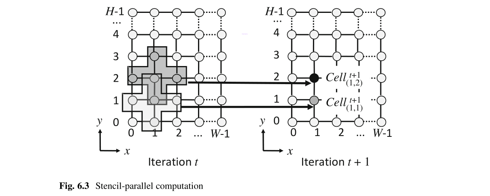

# Ch6 Design Examples

## 6.1 Design of a Stencil-Computation Accelerator

模板(stencil)计算被广泛用于科学计算中，例如流体力学[1]，仿真，电磁仿真[2]，迭代求解器[3]等。在本节中，我们分析模板计算以了解不同类型的并行性并组合这些并行性。然后，我们讨论其体系结构以及应使用哪种类型的OpenCL内核来实现。我们还将讨论如何微调模板计算体系结构，以实现不同FPGA的最佳性能。

### 6.1.1 Stencil Computation

模板是由称为单元的相邻网格点组成的形状。图6.1显示了二维5点模板。当前迭代中这五个单元的数据用于计算下一次迭代中中心单元的值。典型的计算是等式（6.1）给出的乘积之和，其中迭代次数和网格坐标由 $t$ 和 $(x,y)$ 给出。重复此计算以迭代 $t+1$ 中所有像元的值。

$$
\begin{aligned} \operatorname{cell}_{(x, y)}^{t+1}=& k_{1} \times \operatorname{cell}_{(x, y-1)}^{t}+k_{2} \times \operatorname{cell}_{(x-1, y)}^{t}+k_{3} \times \operatorname{cell}_{(x, y)}^{t} \\ &+k_{4} \times \operatorname{cell}_{(x+1, y)}^{t}+k_{5} \times \operatorname{cell}_{(x, y+1)}^{t} \end{aligned} \tag{6.1}
$$

图6.2显示了迭代计算。迭代数据 $t-1$ 用于计算迭代 $t$ 的数据。类似地，将迭代 $t$ 的数据用于迭代 $t+1$ 中的计算。

清单6.1中显示了基于CPU的模板计算源代码。根据等式，在`CPU_iteration`函数中完成迭代的模板计算。（6.1）。在`main`函数中，**当前迭代的输出用作下一个迭代的输入**。

模板计算中有两种类型的并行计算。一个是 **“模版并行计算”**，另一个是 **“迭代并行计算”**。图6.3显示了模版并行计算，其中模版的计算在以 $(1,1)$ 和 $(2,2)$ 为中心的同一迭代 $t$ 中并行完成。由于同一迭代中模板的计算彼此独立，因此可以按任何顺序进行计算，既可以串行也可以并行进行。为了并行计算多个模板，我们也必须并行访问这些模板的数据。由于**数据存储在全局内存中**，因此需要巨大的全局内存带宽。因此，**处理速度受到全局内存带宽的限制**。

图6.4显示了迭代并行计算。假设迭代的计算是从左下角以光栅扫描的方式完成的。灰色区域表示已获取单元格的值。换句话说，灰色区域中的单元格值是可用的。迭代 $t+1$ 的计算需要迭代 $t$ 的数据。当在迭代t中模板以 $(2,2)$ 为中心正在计算时，迭代中 $t+1$ 以 $(1,1)$ 为中心的模版计算所需的数据现在可用。因此，在迭代 $t$ 的以 $(2,2)$ 为中心的模板计算和迭代 $t+1$ 的以 $(1,1)$ 为中心的模板计算可以并行执行。我们称这为**迭代并行计算**。

**模板并行计算不适用于FPGA，因为FPGA的存储带宽小于CPU和GPU的存储带宽**。因此[4-6]之类的许多作品都使用迭代并行计算。这是因为迭代结果使用片上存储器和寄存器可以存储在FPGA内部，而无需访问全局内存。

图6.6中的流程图显示了模版计算的完成方式。首先，输入数据从CPU传输到设备（FPGA板）。然后设置内核参数，并由CPU执行内核。内核在FPGA中处理 $P$ 次迭代。然后，CPU将当前内核执行的输出设置为下一次内核执行的输入。内核执行 $ITERATION/P$ 次，其中 $ITERATION$ 表示模板计算中的迭代次数。最后，计算结果从FPGA传输到CPU。

### 6.1.2 OpenCL-Based Implementation

图6.7显示了[7]中提出的用于模版计算的FPGA体系结构。它由一个DRAM和P个“流水线计算模块”（PCM）组成。迭代的计算是在PCM中完成的。PCM由移位寄存器和多个处理元件（PEs）组成。模板的计算是在PE中完成的。移位寄存器用于将一个PCM的计算结果传输到下一个PCM。

图6.8显示了实现上述数据流所需的移位寄存器数组。**由于生命周期为 $2W+4$**，因此应在相同数量的时钟周期内将数据值存储在移位寄存器中。这意味着，**我们需要一个长度为 $2W+4$ 的移位寄存器**。移位寄存器填满后，较旧的数据将被推出，而新的数据将被推入。

#### 6.1.2.1 Kernel Code

在本节中，我们说明如何设计OpenCL内核代码以生成图6.7所示的加速器。让我们首先声明内核并指定其输入作为以下代码。

Task属性（任务）用于声明单个工作项内核。由于此内核处理 $P$ 次迭代，因此第一次迭代的输入数据为 $din$，迭代 $(P-1)$ 结果是 $dout$。数组 $din$ 和 $dout$ 分别是只读和只写的。对于只读数据访问，有**两种优化方法**。
- Using constant cache
- Using qualifier `global const`

如第5.4节所述，**对于数据大小大于缓存大小的情况，使用`constant cache`效率不高**。我们的模板计算属于这种情况。因此，我们使用限定符`global const`。这使脱机编译器可以执行更积极的优化。

下面显示了如何实现移位寄存器。

移位寄存器的长度等于生命周期。输入数据在迭代0中写入第一个移位寄存器。在每个循环迭代中，所有迭代的移位寄存器的数据都向前移动。最后阶段的数据将被丢弃。

计算 $P-1$ 次迭代（迭代 $0$ 到 $P-2$ ）定义如下。

`#pragma unroll`指令完全展开循环，以使 $P-1$ 并行处理迭代。模版计算所需的数据可从移位寄存器访问。我们对边界数据使用固定值零。在最后一次迭代中（迭代$P-1$），计算结果按如下方式写入全局存储器。

**最终迭代的输出存储在全局存储器中**，而不是移位寄存器中。

清单6.2给出了完整的内核代码。如我们所见，该代码只有61行。如果我们使用HDL，则代码的大小可能超过几千行。【注：代码时并行迭代，也就是并行计算几次迭代（比如执行5次迭代，那么P=5），stencil并行执行每个迭代，但是串行执行每一张网格中的元素。这里的ITERATION指总的迭代，P指在FPGA中可以执行的迭代，毕竟FPGA存储大小有限，随着P增大移位寄存器会增加，另外如图6.7并行执行PE也增多】

#### 6.1.2.2 Host Code

在Host代码中，我们**将当前迭代的输出用作下一个迭代的输入**。这是通过更改内核参数的顺序来完成的，如清单6.3所示。

#### 6.1.2.3 Performance Evaluation

我们使用OpenCL SDK 16.0将内核编译了100次并行迭代（即P=100），并在Nallatech 395-D8 [8] FPGA板上执行15,000次迭代和$8192\times8192$栅格的处理时间为16.8 s。如图6.6所示，由于主机和设备之间的数据传输仅在开始和结束时进行，因此数据传输时间为0.08 s，与总处理时间相比可以忽略不计。

图6.9显示了内核的分析结果。没有停顿，占用率为100％。加载和存储效率都接近100％，因此所有访问的数据都可用于计算（请参见第3.3.2节）。这非常接近我们可以从优化内核中获得的理想分析结果。但是，内存访问带宽小于1 GBps，仅为理论带宽的10％。这表明内存带宽不是瓶颈，我们可以通过执行更多的模板并行计算和访问更多数据来提高性能。

### 6.1.3 Using Loop Unrolling for Performance Improvement

如第6.1.1节所述，随着并行处理更多迭代，处理时间减少。但是，当流水线越来越深时，时钟频率趋于降低。这是由于大型电路的时钟偏斜问题。随着时钟频率降低，即使有更多并行计算，处理时间也可能更长。另一方面，如果FPGA板具有较大的全局存储器带宽，**则可以增加模版并行计算，而减少迭代并行计算**。这样，我们**可以保持相同的并行度，同时保持较高的时钟频率**。

为了增加模版并行计算的程度，我们可以展开循环。注意，我们不能在单个工作项内核中使用属性SIMD。此外，由于边界单元和核心单元之间的计算有所不同，因此无法使用`#pragma unroll`进行自动展开。因此，我们使用手动展开。清单6.4显示了使用循环展开的模板并行计算。循环是手动展开的； 如第7行所示，通过将循环迭代次数设置为$H \cdot W / 2+P \cdot(W / 2+2)$，将并行迭代计算的次数减少一半。如第36至49行所示，在一个循环迭代中计算了两个模板。向量数据类型float2用于确保合并内存访问。

图6.10显示了分析结果。停顿为0％，占用率为100，效率接近100％。这些结果与Sect.6.1.2中以前的内核实现的分析结果非常相似。但是，由于循环展开导致的数据访问增加，因此内存访问带宽增加到将近2GBps。由于吞吐量仍然小于内存带宽，因此我们可以进行更多的模板并行计算。

表6.1比较了没有优化的原始的实现和有循环展开实现的**处理时间**。循环展开的处理时间减少了8.4％。这是因为由于减少了并行迭代计算，时钟频率提高了8.4％。

表6.2比较了没有优化的原始实现和循环展开的**资源利用率**。逻辑，DSP或寄存器利用率没有明显差异。但是，我们可以看到内存和RAM块利用率存在显着差异。在这两种实现方式中，PCM中移位寄存器的大小是相同的。但是，使用循环展开时，迭代并行计算的数量减少到一半。因此，所有PCM中的移位寄存器总数减少到一半。

由于**移位寄存器是使用寄存器和RAM块构造的**，因此减少了这些资源的利用率。结果，提高了时钟频率。

### 6.1.4 Dividing a Large Kernel into Multiple Small Kernels for Performance Improvement

如第6.1.3节所述。**大型电路的时钟频率往往较低。为了解决这个问题，我们可以将一个大内核分为多个小内核**。清单6.5显示了此实现的内核代码。它包含两个内核，`stencil_k1`和`stencil_k2`。我们使用通道`ch_data`连接内核。第一个内核`stencil_k1`将其输出写入通道，而不是全局存储器。第二个内核`stencil_k2`从同一通道读取其输入。

在此实现中，我们同时执行两个内核。同时执行的内核的执行命令**必须放在不同的命令队列中**。为此，我们将两个内核的执行命令放入两个不同的命令队列中，如下所示。

表6.3列出了原始的实现和两个内核实现的**处理时间**的比较。在双内核实现中，处理时间减少了7.6％。这是因为脱机编译器可以优化较小的内核以获得更高的时钟频率。

表6.4显示了原始的实现和两个内核实现的**资源利用**情况的比较。逻辑，DSP，存储器，RAM模块和寄存器利用率没有显着差异。

### 6.1.5 Optimization Using Compiler Options

内存交错导致数据从所有内存bank中交替加载，以平衡所有内存bank中的内存访问带宽，如5.3.2节所述。这需要复杂的数据路径。为了简化内存访问并减少资源开销，我们可以使用非交错内存访问。模板计算内核有一个只读输入和一个只写输出。因此，**我们可以使用非交错访问，其中一个内存bank用作只读存储，另一个内存bank用作只读存储**。由于输入和输出数据的大小相同，因此两个内存bank之间的吞吐量保持平衡。编译器选项`--no-interleaving default`用于编译具有非交错内存访问的内核。

表6.5显示了原始的实现和具有非交错内存访问的实现的**处理时间**的比较。使用非交错存储器访问的实现中，处理时间略微减少了3.5％。这是由于简化的数据路径导致时钟频率的微小改善。

表6.6显示了原始的实现和具有非交错内存访问的实现的**资源利用**情况的比较。资源利用率没有显着差异。

我们也可以使用编译器选项`--fp-relaxed`和`--fpc`来允许编译器重新安排计算顺序，并分别使用融合的浮点运算，如Sect.4.2.2中所述。尽管这会稍微改变计算结果，但是这可能会降低资源利用率并提高性能。

### 6.1.6 Summary of the Results of Different Strategies for Performance Improvement

表6.7显示了不同实现的**处理时间**的比较。

表6.8显示了不同实现的**资源利用**情况的比较。

每个实现都具有相同的并行度，没有任何内存访问瓶颈。因此，所有方法所需的时钟周期数是相同的。然而，时钟频率在实施方式之间是不同的。将循环展开与非交错存储器访问一起使用的实现具有最高的时钟频率和最短的处理时间。这是因为其最小的电路。

## 6.2 Design of a Heterogeneous Computing System for Molecular Dynamic Simulations

分子动力学（MD）模拟对于研究原子和分子的物理性质非常重要[9，10]。但是，即使要模拟实际实验的几纳秒，也需要大量的处理时间。因此，硬件加速非常重要。

有许多广泛用于MD仿真的软件包，例如AMBER [11]，Desmond [12]，GROMACS [13]，LAMMPS [14]，CHARMM [15]等。硬件加速还用于减少大量的处理时间在MD模拟中。MD仿真的ASIC（专用集成电路）实现在[16-18]中提出。但是，设计这样的专用处理器需要花费较长的设计时间，并且还涉及巨大的财务成本。FPGA [19-21]提供了另一种硬件加速方法。在本章中，我们将解释如何在[7，22]中设计基于FPGA的异构计算系统来加速MD仿真。

### 6.2.1 Molecular Dynamics Simulation

原子和分子由于各种作用力而移动[23，24]。通过计算力，我们可以找到运动。因此，MD仿真包含两个主要步骤，即力计算和运动更新，如图6.11所示。当原子移动时，它们的位置会更新。结果，我们必须使用新的原子位置再次计算力。由于原子的运动，力计算和运动更新一次又一次地进行多次迭代。因此，MD仿真被视为迭代计算。它需要数百万次迭代，才能实时模拟几纳秒。注意，运动更新是使用经典的牛顿物理学完成的。当我们知道力，加速度和初始速度时，我们可以使用牛顿方程找到分子在短时间内运动的距离。

力是由原子之间的相互作用引起的。图6.12显示了各种交互。这些相互作用分为键合相互作用和非键合相互作用。键合相互作用是通过共价键连接的原子之间的作用。键合的相互作用会导致拉伸，角度，扭转，如图6.12a所示。由于键合相互作用而产生的力称为键合力。键合力仅影响几个相邻的原子，对于N个原子，可以O(N)时间计算出。非键相互作用是指原子之间没有通过共价键连接的行为。如图6.12b所示，LennardJones势和静电势是这种相互作用，并引起非键合力。由于这些力存在于所有原子之间，因此计算需要$O(N^2)$ 处理时间。因此，非键合力计算需要大量的处理时间，通常占模拟所需的总处理时间的90％以上。

MD仿真使用的系统通常由一个框表示，该框分为多个单元，如图6.13所示。原子和分子在细胞中移动。
为了减少计算量，我们可以忽略彼此相距很远的远距离单元之间的非键合力。该距离称为“截止”距离。
我们解释如何计算两个原子之间的力。首先，我们提取截止距离内的细胞对列表。我们称其为“细胞对列表”。对于每个细胞对，我们计算两个原子之间的非键合力。请注意，同一单元格也与其配对。

### 6.2.2 OpenCL-Based System

图6.14显示了MD仿真的流程图[25]。由于计算量大，**非键合力计算是MD模拟中最耗时的部分。因此，我们将此任务分配给设备（FPGA板）**。其他任务不会花费很多时间，我们将它们分配给主机（CPU）。

图6.15显示了用于非键合力计算的内核代码的简化版本[26]。它包含三个循环。对单元对列表中的每个元素执行循环1的迭代。一个单元对中的单元是cell1和cell2。循环2和循环3计算出cell1和cell2的所有原子对之间的力。循环2和循环3的循环重复数分别等于单元1和单元2的原子数。由于原子移动，因此每个单元的原子数在单元之间以及迭代到迭代之间都不同。因此，**所有三个循环都没有固定（或静态）循环边界**。

图6.16显示了图6.15中所示代码的编译报告。由于循环边界因不同的单元和迭代而不同，因此**未实现流水线架构**。这种非流水线架构不是有效的架构。

表6.9显示了FPGA实现的处理时间。评估结果的详细信息报告在[27]中。测量包含22,795个原子的分子动力学模拟的处理时间。模拟框的宽度，高度和深度为 $61.24\times10^{10}m$。CPU是Intel Xeon E5-1650 v3。FPGA板是Terasic DE5a-Net Arria 10 FPGA开发套件[28]，其中包含Aria 10 10AX115N3F45I2SG FPGA。我们使用Quartus Prime Pro 16.1 wich OpenCL for SDK。根据结果​​，加速器的处理时间是CPU的100倍以上。处理时间长的原因是循环的非流水线实现。

### 6.2.3 Improving Performance by Removing Nested-Loops

为了减少处理时间，我们**必须设计一种流水线架构**。为此，**应在编译阶段很好地定义循环边界**。[22，27]中的工作提出了一种解决这个问题的方法。在这种方法中，力的计算与原子对的选择是分开的。基于单元对列表**提取完整的原子对列表**。然后，对列表中的每个原子对执行力计算。原子对列表提取只是一个搜索过程，不包含大量计算。另一方面，力计算包含许多乘法和除法。因此，主机用于原子对列表提取。该列表被传送到用于力计算的设备。一旦列表可用，**仅一个循环就足以计算列表中所有原子对的力**。【注：把三次循环作为一次循环，把所有cells中的atom-pair提取出来】结果，脱机编译器可以实现流水线数据路径以加快计算速度。

图6.17显示了[22，27]中提出的异构计算任务分配。要在设备中执行非键合力计算，我们必须将原子对列表和原子坐标传输到设备。我们还必须将力的计算结果从设备传输到主机，以进行运动估计。此数据传输会在总处理时间上增加额外的时间。

表6.10显示了使用[22，27]中提出的方法进行的非键合力计算的处理时间。显示了一次迭代的处理时间。由于脱机编译器会生成流水线式数据路径，因此将完成并行处理。结果，设备上的处理时间减少到0.17 s。与主机上的处理相比，这可以使速度提高四倍。

表6.11显示了FPGA加速器的资源使用情况。如表所示，仅使用了16％的FPGA资源。为了进一步提高速度，我们可以使用更多的FPGA资源进行并行计算。注意，还需要宽带宽以及计算资源。如果我们使用80％的FPGA资源和50GBps带宽，则理论上可以获得24.5倍的加速。幸运的是，最近有很多FPGA板具有如此大的带宽[29]。

表6.12显示了包括主机与设备之间的数据传输在内的总处理时间的比较。基于FPGA的异构计算系统的总处理时间为0.50s。CPU和FPGA之间的数据传输占总处理时间的66％。由于进行了这些数据传输，因此与CPU处理相比，其提速仅为1.6倍。

可以通过使用SoC类型的FPGA解决此类数据传输问题，该SoC类型的FPGA在同一芯片中具有CPU内核和FPGA内核。结果，我们可以使用片上数据传输，而不是通过PCIe发送数据。与基于PCIe的传输相比，片上数据传输要快得多。此外，下一代SoC类型的FPGA支持统一存储器，CPU内核和FPGA内核共享同一存储器。在这种情况下，我们根本不需要数据传输。这将大大减少总处理时间。

## 6.3 Design of a Highly-Accurate Image Matching Accelerator

### 6.3.1 Image Matching Using Phase Only Correlation

图像匹配[30]是在两个图像之间找到关联点的过程，如图6.18所示。在诸如立体视觉[31]，运动分析[32]等各种图像处理应用中，这是一项重要而基本的任务。相位相关（Phase-only correlation：POC）[33]是一种具有较高准确性的对应搜索方法。对应搜索在频域中完成，因此可以在子像素级别进行非常精确的图像匹配。离散傅里叶变换（DFT）用于获取图像的频率信息。注意，POC仅使用相位分量[34]。POC用于各种应用，例如3-D测量[35]和生物识别[36]。

通过采用从粗到精的搜索策略来进行对应搜索[37]。为了实现此策略，我们生成了一个多层图像金字塔。图层中图像的分辨率从粗到细提高。图像匹配从包含最粗糙图像的层开始，然后逐渐移动到具有较精细图像的层。我们使用较粗糙的图像粗略地确定相应的点，并随着处理较精细的图像而逐渐提高精度。这种方法可以限制较精细图像的搜索区域，并且可以通过使用较粗糙图像的匹配结果来减少计算量。

图6.19显示了包含多个过程的图像匹配算法的流程图。我们从$k_{max}$层的最粗糙图像开始。我们将DFT应用于图像窗口以获取频率数据。在频域中进行匹配，然后应用逆DFT获得匹配坐标。坐标用于下一层的匹配以限制搜索区域。处理完所有图层的图像后，搜索完成。

### 6.3.2 OpenCL-Based Implementation

如图6.19所示，一个过程的输出用作下一过程的输入。因此，我们必须将数据从一个过程转移到下一个过程。图6.20显示了该算法的最简单实现。每个过程都作为单独的内核实现。这是因为使用多个小内核对于提高时钟频率很重要，如本节所述。6.1.4。内核的输入和输出分别从全局存储器加载并存储到全局存储器。全局存储器用于在内核之间传输数据。此方法与典型的基于GPU的处理非常相似，在不同处理中，使用全局内存传输不同内核的数据。

表6.13显示了FPGA和CPU处理时间的比较。我们使用了包含Stratix V 5SGSED8N2F46C2LN FPGA的Nallatech 395-D8 FPGA板[8]。CPU是Intel Core i7-3960X。CPU代码已完全并行化以使用所有六个内核。FPGA加速器的处理时间几乎是CPU的1.8倍。**FPGA上的处理时间较长的原因是由于内存访问瓶颈**。由于所有内核都在争夺全局内存访问权限，因此所需带宽超过了理论带宽。与CPU和GPU相比，FPGA的带宽更小。实际上，我们使用的FPGA板具有34.1 GBps的理论带宽，比CPU的51.2GBps的存储带宽要小得多。

### 6.3.3 Reducing the Required Bandwidth Using Channels

为了提高性能，我们**必须减少全局内存访问**。为此，我们可以**使用通道在内核之间传输数据**，如Sect.5.7中所述。回想通道是使用片上RAM块和寄存器配置的FIFO缓冲区。

图6.21显示了使用通道的实现。这些通道用于将一个内核的输出作为输入传输到下一个内核，而无需访问全局内存。结果，与图6.20相比，全局存储器访问量大大减少了。

为了进一步减少全局内存访问，我们可以更积极地使用通道。在POC算法中，必须保留上一层关联点的坐标，直到开始计算下一层为止。既然有 $100\times100$ 个关联点，在一个时钟周期内计算出一个关联点，生命周期为10,000个周期。为了存储如此长时间的数据，我们使用了Sect.5.7中介绍的**缓冲通道**。缓冲区大小由depth属性指定。我们将深度设置为与生命周期相同的值10,000。图6.22显示了此实现。由于关联点的坐标是通过通道传递的，因此减少了所需的全局内存带宽。

表6.14显示了CPU，GPU和FPGA实现的处理时间比较。当我们使用通道时，仅使用全局存储器，处理时间可减少至FPGA实现的11％。带通道的FPGA实现的处理时间减少到CPU实现的处理时间的21％。FPGA的处理时间减少到GPU实现的90％。

表6.15列出了每个系统的功耗。功耗定义为执行状态和空闲状态下的功耗之差。基于FPGA的系统的功耗仅为基于GPU的系统的12.3％。因此，我们可以使用OpenCL为低功耗和高性能的实际应用设计系统。

